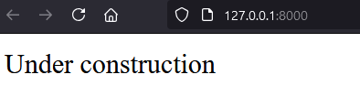

<div align="justify">

## PHP Dossier

- [Práctica 01](#práctica-01)
- [Práctica 02](#práctica-02)
- [Práctica 03](#práctica-03)
- [Práctica 04](#práctica-04)
- [Práctica 05](#práctica-05)
- [Práctica 06](#práctica-06)
- [Práctica 07](#práctica-07)
- [Práctica 08](#práctica-08)
- [Práctica 09](#práctica-09)
- [Práctica 10](#práctica-10)
- [Práctica 11](#práctica-11)
- [Práctica 12](#práctica-12)
- [Práctica 13](#práctica-13)
- [Práctica 14](#práctica-14)
- [Práctica 15](#práctica-15)
- [Práctica 16](#práctica-16)
- [Práctica 17](#práctica-17)
- [Práctica 18](#práctica-18)
- [Práctica 19](#práctica-19)
- [Práctica 20](#práctica-20)


#### Extras:

- [To do - subjects]()


***

### Práctica 01

> 📂
> Modificar el fichero web.php para que las peticiones GET ( parecido al ejemplo anterior ) al raíz de la aplicación: “/” muestren un mensaje que diga: “Under construction
>

```code
 Route::get('/', function () {
    echo "Under construction";
});
```

- Captura:
<div align="center">

</div>

***
</br>

### Práctica 02

> 📂
> Modificar el fichero web.php para que las peticiones POST a: /pruebita muestren el mensaje: “se ha ejecutado una petición POST a la dirección: /pruebita ” Probar a hacer la petición POST ¿ muestra lo solicitado ? ¿ qué ocurre si se hace mediante una petición GET ? Volver a reestablecer la protección CSRF y hacer de nuevo la petición POST ¿ qué muestra ahora ?
>

```code
Route::post('/pruebita', function () {
    echo "Se ha ejecutado una petición POST a la dirección: /pruebita";
});
```

- Captura:

<div align="center">

</div>

</br>

### Práctica 03

> 📂
> Crear una ruta para TODA petición ( ya sea GET, POST, … ) hacia /relatos/numero ( recordar que hemos visto una opción para recoger todo tipo de petición) De tal forma que numero deba ser un número y muestre el mensaje: “petición recibida para
el parámetro: numero”
>

```code
Route::any('/relatos/numeros/{num}', function ($num) {
    echo "Petición recivida para el parámetro: ". $num;
    exit();
})->where('num', '[0-9]+');
```

- Captura:

<div align="center">

</div>

</br>

### Práctica 04

> 📂
> Crear una ruta para el raíz: “/” En una primera implementación mostrará el mensaje: “página raíz de nuestra aplicación” que se resolverá en el propio web.php Haremos una segunda versión de esta actividad en la que redireccionará hacia el controlador y la función pertinente y allí se mostrará un mensaje que indique adicionalmente que se ha respondido desde el controlador
>

```code
Route::get('/', function (){
    echo "Página raíz de nuestra aplicación";
});
```

- Captura:

<div align="center">

</div>

</br>

### Práctica 05

> 📂
> Crear un controlador llamado: ListarProductos que sea redireccionado en web.php cuando se acceda al raíz: “/” y muestre un mensaje que diga: “Ejecutando el controlador ListarProductos mediante get”. ( si la llamada fue get. En el caso de que la llamada fuera post deberá decirlo )
>

```code
Route::get('/', function (){
    echo "Página raíz de nuestra aplicación";
});
```

- Captura:

<div align="center">

</div>

</br>

</div>