<div align="justify">

## PHP Dossier

- [Práctica 01](#práctica-01)
- [Práctica 02](#práctica-02)
- [Práctica 03](#práctica-03)
- [Práctica 04](#práctica-04)
- [Práctica 05](#práctica-05)
- [Práctica 06](#práctica-06)
- [Práctica 07](#práctica-07)
- [Práctica 08](#práctica-08)
- [Práctica 09](#práctica-09)
- [Práctica 10](#práctica-10)
- [Práctica 11](#práctica-11)
- [Práctica 12](#práctica-12)
- [Práctica 13](#práctica-13)
- [Práctica 14](#práctica-14)
- [Práctica 15](#práctica-15)
- [Práctica 16](#práctica-16)
- [Práctica 17](#práctica-17)
- [Práctica 18](#práctica-18)
- [Práctica 19](#práctica-19)
- [Práctica 20](#práctica-20)


#### Extras:

- [To do - subjects]()


***

### Práctica 01

> 📂
> Modificar el fichero web.php para que las peticiones GET ( parecido al ejemplo anterior ) al raíz de la aplicación: “/” muestren un mensaje que diga: “Under construction
>

```code
 Route::get('/', function () {
    echo "Under construction";
});
```

- Captura:
<div align="center">

</div>

***
</br>

### Práctica 02

> 📂
> Modificar el fichero web.php para que las peticiones POST a: /pruebita muestren el mensaje: “se ha ejecutado una petición POST a la dirección: /pruebita ” Probar a hacer la petición POST ¿ muestra lo solicitado ? ¿ qué ocurre si se hace mediante una petición GET ? Volver a reestablecer la protección CSRF y hacer de nuevo la petición POST ¿ qué muestra ahora ?
>

```code
Route::post('/pruebita', function () {
    echo "Se ha ejecutado una petición POST a la dirección: /pruebita";
});
```

- Captura:

<div align="center">

</div>

</br>

### Práctica 03

> 📂
> Crear una ruta para TODA petición ( ya sea GET, POST, … ) hacia /relatos/numero ( recordar que hemos visto una opción para recoger todo tipo de petición) De tal forma que numero deba ser un número y muestre el mensaje: “petición recibida para
el parámetro: numero”
>

```code
Route::any('/relatos/numeros/{num}', function ($num) {
    echo "Petición recivida para el parámetro: ". $num;
    exit();
})->where('num', '[0-9]+');
```

- Captura:

<div align="center">

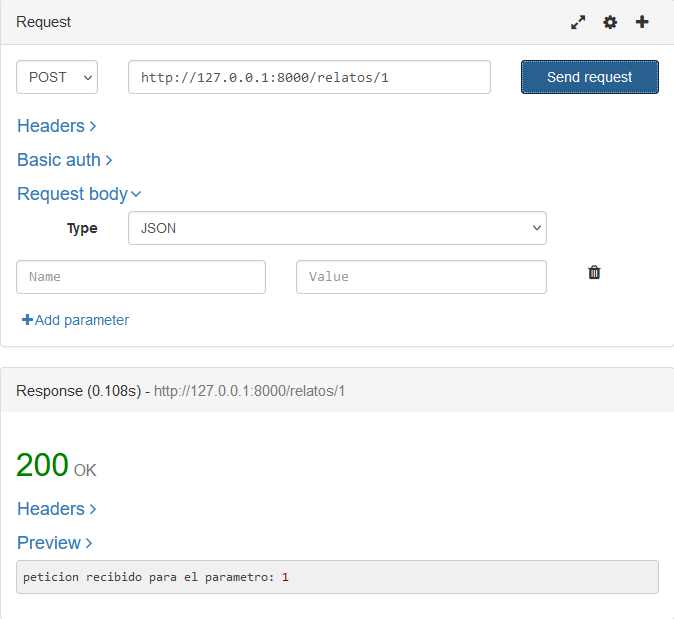

</div>

</br>

### Práctica 04

> 📂
> Crear una ruta para el raíz: “/” En una primera implementación mostrará el mensaje: “página raíz de nuestra aplicación” que se resolverá en el propio web.php Haremos una segunda versión de esta actividad en la que redireccionará hacia el controlador y la función pertinente y allí se mostrará un mensaje que indique adicionalmente que se ha respondido desde el controlador
>

- Version 1:

```code
Route::get('/', function (){
    echo "Página raíz de nuestra aplicación";
});
```

- Captura:

<div align="center">

</div>


- Version 2:

```code
Route::get('/', [Practice04Controller::class, 'controllerResponse']);
```

```code
class Practice04Controller extends Controller
{
    function controllerResponse(){
        echo "Responding from the controller!";
    }
}
```

- Captura:

<div align="center">
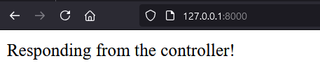
</div>


</br>

### Práctica 05

> 📂
> Crear un controlador llamado: ListarProductos que sea redireccionado en web.php cuando se acceda al raíz: “/” y muestre un mensaje que diga: “Ejecutando el controlador ListarProductos mediante get”. ( si la llamada fue get. En el caso de que la llamada fuera post deberá decirlo )
>

```code
Route::any('/', [ListarProductos::class, 'index']);

class ListarProductos extends Controller
{
    public function index(Request $request) {
        if ($request->isMethod('GET')){
            echo "Ejecutando el controlador ListarProductos mediante get";
        } elseif ($request->isMethod('POST')) {
            echo "Ejecutando el controlador ListarProductos mediante POST";
        }
    }
}

```

- Captura:

<div align="center">
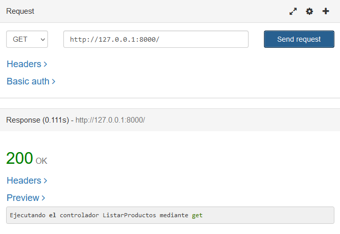

</div>

</br>

### Práctica 06

> 📂
> Comprobar que la anotación @var para un objeto permite que el ide con
inteliphense nos ayude con los atributos y los métodos
>

```code
<?php
class Practice06 {
    /**
     * @var string 
     */
    protected $name;
}
?>
```

- Captura:

<div align="center">

</div>

</br>

### Práctica 07

> 📂
> Reproducir la vista descrita. Crear una tabla html por cada primo con un
encabezado en la tabla que nos diga que campo estamos visualizando.
>

```code
Route::any('/practice07', [Practice07Controller::class, 'primeNums']);
```

```code
class Practice07Controller extends Controller
{
    public function primeNums()
    {
    $primeArray = collect([1,2,3,5,7,11,13,17,19]);
    return view('practice07',compact('primeArray'));
    }
}
```

```code
<!DOCTYPE html>
<html lang="en">
<head>
    <meta charset="UTF-8">
    <meta name="viewport" content="width=device-width, initial-scale=1.0">
    <meta http-equiv="X-UA-Compatible" content="ie=edge">
    <title>Document</title>
</head>
<body class="antialiased">
    @foreach ($primeArray as $num)
    <p> num: {{$num}} </p>
    @endforeach
</body>
</html>
```

- Captura:

<div align="center">

</div>

</br>

### Práctica 08

> 📂
> Agregar al comienzo de la vista el mensaje(sustituye por la hora/día actual): Son las: 17:53 del día: 29-11-2020 Nota: buscar información y usar la función PHP date()
>

```code
Route::get('/practice08', [Practice08Controller::class, 'date']);
```

```code
class Practice08Controller extends Controller
{
    public function date() {
        $currentDateTime = date('H:i \d\e l, d-m-Y');
        return view('practice08', compact('currentDateTime'));
    }
}
```

```code
<!DOCTYPE html>
<html lang="en">
<head>
    <meta charset="UTF-8">
    <meta name="viewport" content="width=device-width, initial-scale=1.0">
    <meta http-equiv="X-UA-Compatible" content="ie=edge">
    <title>Document</title>
</head>
<body class="antialiased">
        <h1>{{$currentDateTime}}</h1>
</body>
</html>
```

- Captura:

<div align="center">
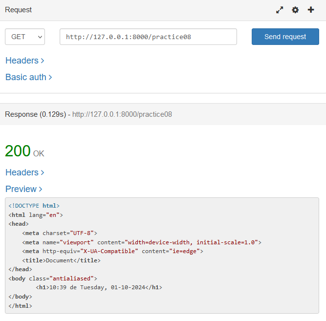
</div>

</br>

### Práctica 09

> 📂
> El comando sleep() en php permite pausar la ejecución la cantidad de segundo especificada como parámetro. Modificar el ejemplo anterior para que lo muestre 3 veces con una espera de 1 segundo entre una iteración y la siguiente, mostrando de forma actualizada la información de los segundos desde 1970
>

```code
Route::get('/practice09', function(){
    return view('practice09');
});
```


```code
    @php
        $dataSecondsArray = [];

        for($i=0; $i < 3; $i++){
            $seconds = time();
            $dataSecondsArray[$i] = $seconds;
            sleep(1);
        }
        
    @endphp

    @foreach ($dataSecondsArray as $seconds ){
        <h1>Since 1-01-1970 have passed: {{$seconds}} seconds</h1>
    }
        
    @endforeach
```

- Captura:

<div align="center">

</div>

</br>

### Práctica 10

> 📂
>Generar una lista de números aleatorios de 0 a100 en el controlador. Desde
nuestra plantilla blade mostraremos primero la lista de números obtenidos menores de 50 y un poco más abajo en la página los mayores que 50. Hacer uso de las directivas @if para que al mostrar aquellos que sean mayores de 50
>

```code
Route::get('/practice10', [Practice10Controller::class, 'rndNum']);
```

```code
    public function rndNum() {
        $array = [];
        for ($i = 0; $i < 15; $i++) {
            $array[] = rand(1, 100);
        }
        return view('practice10', compact('array'));
    }
```

```code
    <h2>Smaller than 50:</h2>
    <ul>
        @foreach ($array as $num )
            @if ($num < 50)
                <li>{{$num}}</li>
            
            @endif
        
        @endforeach
    </ul>

    <h2>Greater than 50:</h2>
    <ul>
        @foreach ($array as $num )
            @if ($num > 50)
                <li>{{$num}}</li>
            
            @endif
        
        @endforeach 
    </ul>
```

- Captura:

<div align="center">

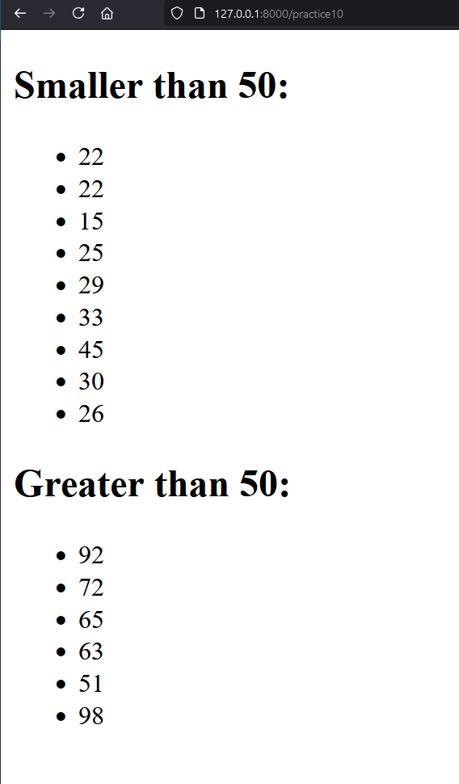
</div>

</br>


### Práctica 11

> 📂
> Enviar en un textarea una lista de palabras separadas por comas. Mostrar en
una lista html esas palabras recibidas (una palabra por cada <li> de la lista ) convertidas todas a mayúsculas. Para ello se usará el bucle: @for ( cuidado! No el foreach ) Observar que eso implicará “contar” el número de elementos que tiene la colección de palabras
>

```code
Route::get('/processwords', [Practice11Controller::class, 'processWords']);
```

- practice11.blade.php

```code
    <form action="processwords" method="GET">
        <textarea name="words" placeholder="Word's list">ç</textarea>
        <input type="submit" value="Send">
    </form>
```

- practice11Controller.php

```code
class Practice11Controller extends Controller
{
    public function processWords(Request $request) {
        $words = explode(',',  $request->input('words')??null);

        return view('practice11result', [
            'words' => $words,
        ]);
    }
}
```

- practice11result.blade.php

```code
    @php
    $length = count($words);
    @endphp

    <ul>
        @for ($i=0; $i<$length; $i++)
            <li>{{$words[$i]}}</li>
        @endfor
    </ul>
```

- Captura:

<div align="center">

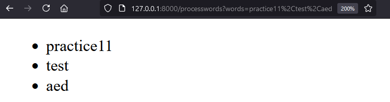
</div>

</br>

### Práctica 12

> 📂
> Ubicar imágenes en la carpeta descrita para las imágenes que quieras mostrar
( mínimo 5 ). Hacer que se visualicen en el navegador las imágenes en nuestra vista
>

```code
Route::get('/practice12', [Practice12Controller::class, 'showImgs']);
```

- practice12Controller.php

```code
class Practice12Controller extends Controller
{
    function showImgs(){
        $imgArray =['img1.jpg', 'img2.jpg', 'img3.jpg', 'img4.jpg', 'img5.jpg'];
    
        return view('practice12', compact('imgArray' ));
    }
}
```

- practice12.blade.php

```code
    @foreach ($imgArray as $img)
        
    @endforeach
```


- Captura:

<div align="center">
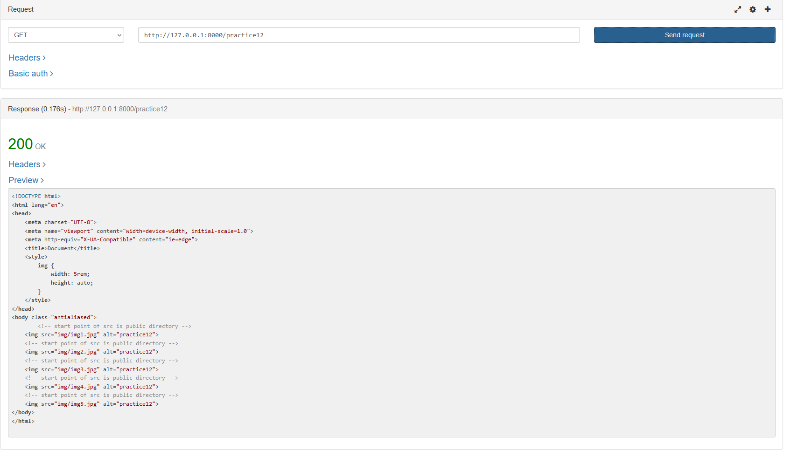

</div>

</br>

### Práctica 13

> 📂
> Crear un formulario que envíe nombres de colores en cada ejecución del usuario. Obtendrá por respuesta una página con la lista de colores que ha ido introduciendo (usar session() para almacenar la lista de colores ) ( es un formulario post tendremos que tener en cuenta @csrf leer más abajo )
>

```code
Route::get('/practice13', [Practice13Controller::class, 'getColors']);
Route::post('/add-color', [Practice13Controller::class, 'addColor']);
Route::post('/delete-color/{id}', [Practice13Controller::class, 'deleteColor']);
```

- practice13Controller.php

```code
class Practice13Controller extends Controller
{
    public function getColors() {
        $colors = session()->get('colors', []);

        if(!isset($colors)){
            $colors = [];
            session()->put('colors', $colors);
        }
      
        return view('practice13', compact('colors'));    
    }
    
    public function addColor(Request $request){
        $colors = session()->get('colors', []);

        $name = $request->input('color')??null;
        $id = count($colors) + 1;
      

        $newColor = new Color( $id, $name);
        $colors[] = $newColor;

        session()->put('colors', $colors); 

        return redirect('/practice13');
    }

    public function deleteColor(Request $request){
        $colors = session()->get('colors', []);
        $id = $request->input('id');

        foreach($colors as $key => $item){
            if($item->getId() == $id){
                unset($colors[$key]);
                break;
            }
        }

        session()->put('colors', array_values($colors));
        return redirect('/practice13');
    }

}
```

- practice13.blade.php

```code
   <form method="POST" action="{{ url('/add-color')}}">
        @csrf
        @if(isset($color))
            <input type="hidden" name="id" value="{{ $color->id }}">
        @endif
        <label for="color">Color's name: </label>
        <input type="text" name="color" id="color">
        <br>
        <input type="submit" name="submit" id="submit" value="Send">
    </form>
    <br>
    <div class="history">
        <ul>
            @if(!empty($colors))
                @foreach ($colors as $color)
                <li>
                    {{ $color->getName() }}
                    <form method="POST" action="{{ url('/delete-color/'.$color->id) }}">
                        @csrf
                        <input type="hidden" name="id" value="{{ $color->id }}">
                        <button type="submit">Delete</button>
                    </form>
                </li>
                @endforeach
            @else
                <li>Empty list.</li>
            @endif
        </ul>
    </div>
```

- Captura:

<div align="center">

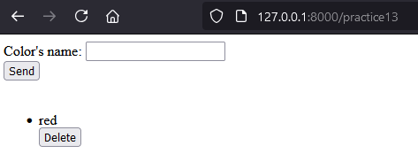
</div>

</br>


### Práctica 14

> 📂
>Una forma fácil de visualizar el token csrf es mediante: {{ csrf_token() }}
Introducir en la práctica 12 ese código y comprobar que está activo.
>

- practice12.blade.php modificado

```code
<body class="antialiased">
    <p>CSRF Token: {{ csrf_token() }}</p>
    @foreach ($imgArray as $img)
        
    @endforeach
</body>
```

- Captura:

<div align="center">

</div>

<br>


### Práctica 15

> 📂
>Crear un formulario POST Con los datos de un posible usuario ( nombre,
edad, gustos, etc ) En cada ejecución de este formulario se le muestra al usuario la información almacenada del usuario en session() Observar que si se envía el formulario sin rellenar algún campo, se mantendrá la información anterior respecto a ese campo
>

- web.php

```code
Route::get('/practice15', [Practice15Controller::class, 'showForm']);

Route::post('practice15/update', [Practice15Controller::class, 'handleForm']);
```


- practice15.blade.php
```code
<div class="main-container">
    @if(session('success'))
        <p> {{session('success')}}</p>
    @endif

    <p>DATA: {{session('name')}}, {{session('age')}}, {{session('likes')}}</p>
    <form action="{{ url('/practice15/update')}}" method="POST">
        @csrf
            <label for="name">Name</label>
            <input type="text" name="name" id="name" value="{{session('name')}}" />
            <br>
            <label for="age">Age</label>
            <input type="text" name="age" id="age" value="{{session('age')}}" />
            <br>
            <label for="likes">Likes</label>
            <input type="text" name="likes" id="likes" value="{{session('likes')}}" />
            <br>
            <input type="submit" name="submit" value="submit">
    </form>
    <br>
</div>
```

- controller:


```code
    public function showForm(Request $request) {

        $name = session()->get('name');
        $age = session()->get('age');
        $likes = session()->get('likes');

        return view('practice15', compact('name', 'age', 'likes'));
    }

    public function handleForm(Request $request)
    {
        $nameSession = session()->get('name', '');
        $ageSession = session()->get('age', '');
        $likesSession = session()->get('likes', '');

        $nameUpdate = $request->get('name', $nameSession);
        $ageUpdate = $request->get('age', $ageSession);
        $likesUpdate = $request->get('likes', $likesSession);

        $request->session()->put('name', $nameUpdate);
        $request->session()->put('age', $ageUpdate);
        $request->session()->put('likes', $likesUpdate);

        return redirect('practice15')->with('success', 'Updated correctly.');
    }
```  

- Captura:

<div align="center">
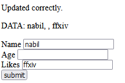
</div>

<br>


### Práctica 16

> 📂
>Crear un fichero con nombre y dirección de correo por fila ( en formato csv )
almacenado en Storage Leer el fichero y mostrarlo en pantalla
>


- web.php

```code
 Route::get('/practice16', [Practice16Controller::class, 'readCsv']);
```


- practice16.blade.php
```code
<div class="main-container">

    <h3>Data of the csv:</h3>
    <ul>
        @foreach($data as $row)
        <li>
            {{ $row['name'] }} -- {{ $row['email'] }} 
        </li>
    @endforeach
    </ul>
</div>
```

- controller:
```code
public function readCsv (){
    $csvContent = Storage::get('users.csv');
    $rows = explode("\n", $csvContent);
    $data = [];

    foreach ($rows as $row) {
        $columns = explode(',', $row);
        $data[] = [
            'name' => $columns[0],
            'email' => $columns[1],
        ];
    }

    return view('practice16', compact('data'));
}
```

- Captura:

<div align="center">

</div>

<br>

### Práctica 17

> 📂
>Crear un formulario que se introduzca un nombre y cree un directorio en
storage con ese nombre
>

```code
Route::get('/practice17', function (){
    return view('/practice17');
});

Route::post('/create-directory', [Practice17Controller::class 'createDirectory']);
```

- practice17Controller.php

```code
class Practice17Controller extends Controller
{
    public function createDirectory(Request $request){
        $directory = $request->input('directory');
        if($directory ==! null){
            Storage::makeDirectory('/' . $directory, 700, true);
            echo "Directory created successfully";
        }
        return view('/practice17');
    }

}
```

- practice17.blade.php

```code
     <form method="POST" action="{{ url('/create-directory')}}">
        @csrf
        @if(isset($directory))
            <input type="hidden" name="id" value="{{ $color->id }}">
        @endif
        <label for="directory">Directory's name: </label>
        <input type="text" name="directory" id="directory">
        <br>
        <input type="submit" name="submit" id="submit" value="Send">
    </form>
    <br>
    <div class="history">
            
    </div>
```

- Captura:

<div align="center">

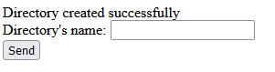
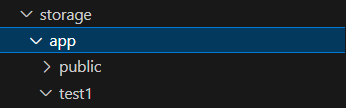
</div>

</br>

### Práctica 18

> 📂
>Crear un formulario que se introduzca un nombre y cree un directorio en
storage con ese nombre
>

```code
Route::get('/practice18', function (){
    return view('/practice18');
});

Route::post('/read-file', [Practice18Controller::class, 'readFile']);
```

- practice18Controller.php

```code
class Practice18Controller extends Controller
class Practice18Controller extends Controller
{
    public function readFile(Request $request) {
        if (!$request->hasFile('myFile')) {
            return back()->withErrors(['myFile' => 'No se ha subido ningún archivo.']);
        }

      
        $file = $request->file('myFile');

        $content = [];

        $fileOriginalName = $file->getClientOriginalName();

        $path =$file->storeAs("/", $fileOriginalName);
        
        if (($open = fopen(storage_path('app/' . $path), "r")) !== FALSE) {
            while (($data = fgetcsv($open, 1000, ",")) !== FALSE) {
                $content[] = $data;
            }
            fclose($open);
        }

        return redirect('/practice18')->with('content', $content);
    }
}

```

- practice18.blade.php

```code
    <form method="POST" action="{{ url('/read-file')}}" enctype='multipart/form-data' >
        @csrf
        <input type="file" name="myFile" id="myFile">
        <br>
        <input type="submit" name="submit" id="submit" value="Send">
    </form>
    <br>
    <div class="history">
        @if (session('content') && count(session('content')) > 0)
            <ul>
                @foreach (session('content') as $row)
                    <li>{{ implode(', ', $row) }}</li>
                @endforeach
            </ul>
        @endif
    </div>
```

- Captura:

<div align="center">
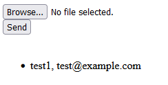
</div>

</br>

### Práctica 19

> 📂
> Mostrar en una página una lista de ficheros de una carpeta en storage.
Cuando se pulse en el nombre del fichero se descargará
>

- web.php

```code
Route::get('/practice19', [Practice19Controller::class, 'showFiles']);
Route::get('/practice19/download/{filename}', [Practice19Controller::class, 'downloadFile']);
```

- practice19Controller.php

```code
    public function showFiles(){
        $files = Storage::files('practice19'); 
        return view('practice19', compact('files'));
    }


    public function downloadFile($filename){
        return Storage::download('practice19/' . $filename);
    }
```

- practice19.blade.php

```code
    <div class="main-container">
        <h1>Files in directory</h1>
        <ul>
            @foreach ($files as $file)
                <li>
                    <a href="{{ url('practice19/download/' . basename($file)) }}">{{ basename($file) }}</a>
                </li>
            @endforeach
        </ul>

        @if ($files === null)
            <p>There are no files in this directory.</p>
        @endif
    </div>
```

- Captura:

<div align="center">

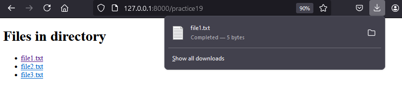

</div>

</br>

### Práctica 20

> 📂
> Mostrar en una página una lista de ficheros de una carpeta en storage.
Cuando se pulse en el nombre del fichero se descargará
>

- web.php

```code
Route::get('/practice19', [Practice19Controller::class, 'showFiles']);
Route::get('/practice19/download/{filename}', [Practice19Controller::class, 'downloadFile']);
```

- practice19Controller.php

```code
    public function showFiles(){
        $files = Storage::files('practice19'); 
        return view('practice19', compact('files'));
    }


    public function downloadFile($filename){
        return Storage::download('practice19/' . $filename);
    }
```

- practice19.blade.php

```code
    <div class="main-container">
        <h1>Files in directory</h1>
        <ul>
            @foreach ($files as $file)
                <li>
                    <a href="{{ url('practice19/download/' . basename($file)) }}">{{ basename($file) }}</a>
                </li>
            @endforeach
        </ul>

        @if ($files === null)
            <p>There are no files in this directory.</p>
        @endif
    </div>
```

- Captura:

<div align="center">


</div>

</br>

</div>