<div align="justify">

## PHP Dossier

- [Práctica 01](#práctica-01)
- [Práctica 02](#práctica-02)
- [Práctica 03](#práctica-03)
- [Práctica 04](#práctica-04)
- [Práctica 05](#práctica-05)
- [Práctica 06](#práctica-06)
- [Práctica 07](#práctica-07)
- [Práctica 08](#práctica-08)
- [Práctica 09](#práctica-09)
- [Práctica 10](#práctica-10)
    - [Práctica 10 - Recursividad](#práctica-10)
- [Práctica 11](#práctica-11)
- [Práctica 12](#práctica-12)
- [Práctica 13](#práctica-13)
- [Práctica 14](#práctica-14)
- [Práctica 15](#práctica-15)
- [Práctica 16](#práctica-16)
- [Práctica 17](#práctica-17)
- [Práctica 18](#práctica-18)
- [Práctica 19](#práctica-19)
- [Práctica 20](#práctica-20)
- [Práctica 21](#práctica-21)
- [Práctica 22](#práctica-22)
- [Práctica 23](#práctica-23)
- [Práctica 24](#práctica-24)
- [Práctica 25](#práctica-25)
- [Práctica 26](#práctica-26)
- [Práctica 27](#práctica-27)
- [Práctica 28](#práctica-28)
- [Práctica 29](#práctica-29)
- [Práctica 30](#práctica-30)
- [Práctica 31](#práctica-31)
- [Práctica 32](#práctica-32)
- [Práctica 33](#práctica-33)
- [Práctica 34](#práctica-34)
- [Práctica 35](#práctica-35)
- [Práctica 36](#práctica-36)
- [Práctica 37](#práctica-37)

#### Extras:

- [Formulario - Descomponer Número]()
- [Formulario - Tablas]()


***

### Práctica 01

> 📂
> Crear el script como se ha comentado sustituyendo “alumno” por nuestro
nombre completo. Tomar captura de pantalla del resultado
>

- Captura:
<div align="center">

</div>

***
</br>

### Práctica 02

> 📂
> Crear el script anterior. Modificarlo para sumar a $un_str el valor de $un_int y mostrarlo en pantalla ¿ qué ocurre ?
>

Podemos observar como la operación no se puede realizar porque los dos variables que estamos sumando son de distintos tipos.

- Captura:

<div align="center">

</div>

</br>

> 📂
> Sumar $un_str con $un_str2 ¿ qué ocurre ?
>

No se nos permite concatener cadenas de texto utilizando operadores como '+' al contrario que en Java.

- Captura:

<div align="center">

</div>

</br>

> 📂
> ¿ Se puede concatenar una cadena con comillas
simples con una con comillas dobles ?
>

Gracias al operador '.' nos es posible concatener cadenas de texto sin importar si estas son de comillas simples o dobles.

- Captura:

<div align="center">

</div>

***

</br>

## Práctica 03

> 📂
> Realizar el código anterior y tomar captura de pantalla del resultado. ¿ qué es lo
que ha ocurrido ?
>

Se nos muestra el parrafo del echo. La suma se visualiza gracias al uso del print en vez de a la declaración de la variable resultado.

- Captura:

<div align="center">

</div>

</br>

> 📂
> Poner código html antes de la declaración de strict_types y probar de
nuevo ¿ qué ocurre ahora ?
>

Tenemos un error, ya que las declaraciones de strict_types deben ser lo primero en nuestro fichero php.

- Captura:

<div align="center">

</div>

***
</br>

## Práctica 04

> 📂
> ¿ Da error ? ¿ Por qué ?
>

Al probar el código proporcionado, observamos que no hay error y en efecto la función funciona correctamente. Esto es debido a que estamos devolviendo un resultado que tiene el tipo de variable que se espera.

- Captura:

<div align="center">

</div>

</br>

> 📂
> Quitar el comentario a: return $a; ¿ Da error ahora ? ¿ Por qué ?
>

Al realizar el cambio, nos encontramos con un error puesto que en la función igualamos '$a' a una cadena de texto y al ahora retornar este argumento en vez de '$b' tenemos un error, ya que la propia función especifica que devuleve un valor entero.

- Captura:

<div align="center">

</div>

</br>

> 📂
> Quitar comentario a: print fun(“e”,3); ¿ Da error ?
>

Tras realizar este cambio, también tenemos un error. En este caso es por pasarle por parametros a la función un tipo de dato distinto al esperado.

- Captura:

<div align="center">

</div>

***
</br>

## Práctica 05

> 📂
> Probar el código anterior. Probar ahora con números ¿ también funcionan las referencias ?
>

Originalmente funciona de esta manera.

- Captura:

<div align="center">

</div>

Al realizar el cambio a valores númericos se muestra de la siguiente forma, donde podemos apreciar que sigue funcionando;

- Captura:

<div align="center">


</div>

***
</br>

## Práctica 05.5

> 📂
> Crear un array: $mivar = []; Introducir datos: array_push($mivar,”uno”); y hacer una asignación a otras variables. Una por referencia y la otra por valor: $arr1 = $mivar; $arr2 = &$mivar; modificar la posición cero de esas variable : $arr1[0] = “una variación”; $arr2[0] = “variando array2 ”; y mostrar el contenido de $mivar[0] y $arr1[0] ¿ qué es lo que ha ocurrido ? ( tomar captura de pantalla y explicarlo )
>

- Captura:

<div align="center">

</div>

***
</br>

## Práctica 06

> 📂
> Hacer un script php que haga echo de $_SERVER y de $_SERVER
[PHP_SELF] tomar captura de pantalla de los resultados
>

- Código:

```
<?php
    var_dump ($_REQUEST);  
    var_dump ($_SERVER["SERVER_NAME"]);
    var_dump ($_SERVER[PHP_SELF]);  
?>
```

- Captura:

<div align="center">

</div>

***

## Práctica 07

> 📂
> Visualizar lo anterior ¿ se encuentran diferencias entre null y unset() ? Tomar
captura de pantalla
>

- Código:

```
<?php
    $variable = null;
    var_dump($variable);
    echo "</br>";
    unset($variable);
    var_dump($variable);
?>
```

A simple vista, podemos apreciar como establpecer un valor nulo en la variable simplemente lo define como tal mientras que si utilizamos unset se nos especifica donde hemos dejado la variable nula.

- Captura:

<div align="center">

</div>

***
</br>

## Práctica 08

> 📂
> Ejecutar el script anterior ¿ hay alguna diferencia antes y después del cast ?
Tomar captura de pantalla
>

- Código:

```
<?php
    $unavar = 1.3;
    var_dump($unavar);
    echo "<br>";
    $unavar = (int) $unavar;
    var_dump($unavar);
?>
```

Podemos apreciar una diferencia clara puesto que el valor de '$unavar' a cambiado de un  float a un entero por lo que ha perdido su parte decimal al truncarse.

- Captura:

<div align="center">

</div>

***
</br>

## Práctica 08.5

> 📂
> ¿ Qué ámbito tienen las constantes ? ¿ realmente no se puede poner varios
valores en un constante ?
>

Las constantes tienen un ámbito global, es decir que se puede acceder a ellas unas vez declaradas desden cualquier método del scripts. Una vez ya hayamos declarado el valor de una constante no podremos redefinirlo o modificarlo.

> 📂
> Probar fuera de una función a crear constante:
const PULGADA = 2.53; ahora tratar de establecerla de nuevo mediante: PULGADA = 7; const PULGADA = 8; $PULGADA = 9; hacer echo en cada caso.
>
- Código:

```
<?php
    const PULGADA = 2.53;
    var_dump(PULGADA);
    echo "</br>";
    const PULGADA = 8;
    var_dump(PULGADA);
    echo "</br>";
    $PULGADA = 9;
    var_dump(PULGADA);
?>
```

> 📂
>Crear la constante en ámbito global ( fuera de función ) ¿ se puede acceder dentro de una función ? ¿ se puede establecer: const PULGADA = 10 dentro de una función ?
Tomar capturas de pantalla en cada caso y explicar lo que ha ocurrido
>

- Código:

```
<?php
    const PULGADA = 2.53;
    
    function testConstants(){
        //const PULGADA_LOCAL = 10; NO se pueden establecer dentro de una función
        return PULGADA;
    }
?>
```

Si hemos creado la variable globalmente no tendremos problema en llamarla dentro de una función para utilizarla, en cambio si intentamos declarar en este caso la constante 'PULGADA_LOCAL' dentro de la función tendremos un error de sintaxis.

- Captura:

<div align="center">

</div>

***
</br>

## Práctica 09

> 📂
> Crear un script que muestre las potencias del número 2 desde 2¹ hasta 2⁹ hacer
uso del operador: ** Ir concatenando las salidas en pantall de las potencias en una string mediante el operador de concatenación y asignación: .=
>

- Código:

```
<?php
    function exponentation(){
        $num = 2;
        for($i = 0; $i < 10; $i++){
            $str = $num;
            $str .= "^".$i;
            echo $str. " = ". ($num**$i). "<br>";
        }
    }   

    exponentation(); 
    echo "<br>";
?>
```

- Captura:

<div align="center">

</div>

***
</br>

## Práctica 10

> 📂
> Crear un programa en php que obtenga la descomposición de un número que
esté almacenado en la variable: $numero Por ejemplo: $numero = 3102 Se pretende que se utilicen en el programa los operadores: .= , **. Para el ejemplo anterior se debe mostrar en pantalla: 2 *1 + 0* 10 + 1 *100 + 3* 1000
>

- Código:

```
<?php

function decompositionNum($num) {
    $numAux = $num;

    $units = (int) $numAux % 10;
    $numAux = (int) ($numAux / 10);
    $tens = (int) $numAux % 10;
    $numAux = (int) ($numAux / 10);
    $hundreds = (int) $numAux % 10;
    $numAux = (int) ($numAux / 10);
    $thousand = (int) $numAux % 10;

    return $units . " * 1 + " . $tens . " * 10 + " . $hundreds . " * 100 + " . $thousand . " * 1000";    
}

echo decompositionNum(3102);

?>
```

- Captura:

<div align="center">

</div>

***
</br>

## Práctica 11

> 📂
> Ejectuar el script y tomar captura de pantalla
>

- Código:

```
<?php
$var = "";
    if(empty($var)){ // true because "" is considered empty
        echo '<br>empty($var) para $var="" ';
    }else{
        echo '<br>!empty($var) para $var="" ';
    }

    if(isset($var)){ //true because var is set
        echo '<br>isset($var) para $var="" ';
    }else{
        echo '<br> !isset($var) para $var="" ';
    } if(empty($otherVar)){ //true because $otherVar is null
        echo '<br>empty($otherVar) para $otherVar que no se ha establecido ';
    } else {
        echo '<br> !empty($otherVar) para $otherVar que no se ha establecido ';
    }
    if(isset($otherVar)){ //false because $otherVar is not set
        echo '<br>isset($otherVar) para $otherVar que no se ha establecido ';
    } else {
        echo '<br> !isset($otherVar) para $otherVar que no se ha establecido ';
    }
?>
```

- Captura:

<div align="center">

</div>

***
</br>

## Práctica 12

> 📂
>Probar el script anterior y observar que ocurre. ¿ qué mensaje de error se observa ?
>

- Código:

```
<?php
    $array = array('uno' =>1, 'dos'=>2, 'tres'=>40, 'cuatro'=>55);
    $str = "La posición 'tres' contiene el dato $array['tres']";
?>
```

Se nos muestra un error de sintax al estar llamando a la variable '$array' de esta forma.

- Captura:

<div align="center">

</div>

Para poder solucionarlo debemos de utilizar la siguiente sintaxis:

```
<?php
    $array = array('uno' =>1, 'dos'=>2, 'tres'=>40, 'cuatro'=>55);
    $str = "La posición 'tres' contiene el dato {$array['tres']}";
?>
```

***
</br>

## Práctica 13

> 📂
> Probar el script anterior y observar que ocurre. Probar ahora con llaves:
${$variable} ¿ hay diferencia ?
>

- Código:

```
<?php
    $variable = 'dato';
    $dato = 5;
    echo ${$variable}.'<br>';
?>
```

No hay ninguna diferencia, se nos sigue mostrando el valor de '$dato' como 5;

- Captura:

<div align="center">

</div>

***
</br>

## Práctica 14

> 📂
> Toma el código anterior e introduce una expresión “variable de variables” que
permita definir las variables: $dato0, $dato1, …, $dato9 Cada una de ellas con el valor
correspondiente: 0, 1,…,9
>

- Código:

```
<?php
    $var = 'dato';
    for($i=0; $i<10; $i++){
        ${$var.$i} = $i;
    }
    echo "<br> ${'dato0'} ";
    echo "<br> ${'dato1'} ";
    echo "<br> ${'dato2'} ";
    echo "<br> ${'dato3'} ";
    echo "<br> ${'dato4'} ";
    echo "<br> ${'dato5'} ";
    echo "<br> ${'dato6'} ";
    echo "<br> ${'dato7'} ";
    echo "<br> ${'dato8'} ";
    echo "<br> ${'dato9'} ";
?>
```

- Captura:

<div align="center">

</div>

***
</br>

## Práctica 15

> 📂
> Ejecutar el script anterior ¿ se muestran las posiciones anteriores a la 2 ? ¿ y
entre la 2 y la 7 ?. Realizar el mismo script pero en lugar de crear el array mediante los
corchetes: $array = [] hacerlo con la función array() ¿ hay diferencias en la salida en
pantalla ? Ejecutar var_dump($array) después de cada asignación de un valor al array.
Tomar captura de pantalla de los resultados
>

- Código:

```
<?php
    $array = [];
    $array[2]="mensaje";
    $array[7]="lalala!";
    $array[]="yepa yepa!!";
    var_dump($array);
?>
```

+

NO se muestran las posiciones anteriores a la 2 ni entre esta y la 7, puesto que están vacias.

- Captura:

<div align="center">

</div>

</br>

> 📂
> Realizar el mismo script pero en lugar de crear el array mediante los
corchetes: $array = [] hacerlo con la función array() ¿ hay diferencias en la salida en
pantalla ? Ejecutar var_dump($array) después de cada asignación de un valor al array.
Tomar captura de pantalla de los resultados
>

- Código:

```
<?php
    $array = [];

    $array[2]="mensaje";
    var_dump($array);
    echo "</br>";


    $array[7]="lalala!";
    var_dump($array);
    echo "</br>";


    $array[]="yepa yepa!!";
    var_dump($array);
    echo "</br>";

    $array2 = array();
    $array2[2]="mensaje";
    var_dump($array2);
    echo "</br>";

    $array2[7]="lalala!";
    var_dump($array2);
    echo "</br>";

    $array2[]="yepa yepa!!";
    var_dump($array2);

?>
```

- Captura:

<div align="center">

</div>

***
</br>

## Práctica 15.5

> 📂
> Crear un array asociativo dejando sin poner en algunas ocasiones la parte de la clave dejando únicamente el valor ( al estilo de si fuera un array no asociativo ) hacer un var_dump() y recorrerlo con un for ( no con un foreach) ¿ muestra algún valor ? ¿ genera error ?
>

- Código:

```
<?php
    $array = [];
    $array[2]="mensaje";
    $array[7]="lalala!";
    $array[]="yepa yepa!!";

    echo "<br>";

    for($i = 0; $i < 9; $i++){
        if(isset($array[$i])){
            var_dump($array[$i]);
        } 
    }
?>
```

Muestra correctamente valor con su clave asociada sin generar errores.

- Captura:

<div align="center">

</div>

***
</br>

## Práctica 16

> 📂
> Ejecutar el script anterior. ¿ Tenemos que usar los nombres de variables $key
y $val ? Sustituir por otros nombres de variables y ver si hay algún problema
>

- Código:

```
<?php
    $array = array('perro', 'gato', 'avestruz');
    foreach ($array as $index => $animals) {
        print "array[ $index ] = $animals </br>";
    }
?>
```

Funciona exactamente igual tanto si dejamos las variables como '$key' y '$value' que intercambiandolos por otros nombres mientras se cumpla bien la sintaxis.

- Captura:

<div align="center">
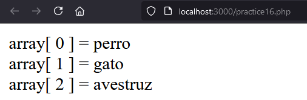
</div>

***
</br>

## Práctica 17

> 📂
> Ejecutar el script anterior. En Java eliminar elementos de un array en un
foreach implica un error ¿ también en php ? Tomar captura de pantalla del resultado
>

- Código:

```
<?php
    $array = [];
    for($i=0;$i<5;$i++){
        $array[] = "a" . $i;
    }

    $j=count($array);
    foreach( $array as $key => $val){
        $j--;
        unset($array[$j]);
        echo "<br>";
        var_dump($array);
        echo "<br> $key => $val ";
        echo "<br>";
    }
?>
```

En PHP he podido apreciar que hay ningun tipo de error al elimnar los valores de un array usando un for each, en cambio como apreciamos como los va eliminando correctamente.

- Captura:

<div align="center">
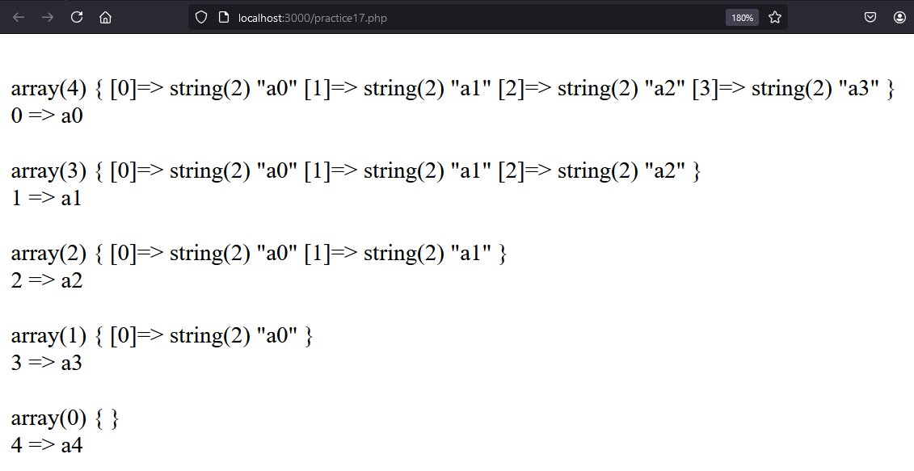
</div>

***
</br>

## Práctica 18

> 📂
> Ejecutar el script anterior. Modificar los echo para que se sepa cuando
llamamos a $array ( recordar que con comillas simples no interpreta ) Tomar captura de pantalla
>

- Código:

```
<?php
    $array = ["a","a","a","a","a"];
    $j=count($array);
    foreach( $array as $key => &$val){
        $j--;
        $array[$j] .= $j;
        echo "<br>";
        var_dump($array);
        echo "<br> $key => $val";
        echo "<br> $key => $array[$key]";
        echo "<br>";
    }

    $arr = array(1, 2, 3, 4);
    foreach ($arr as &$val) {
        $val = $val * 2;
        print_r($arr);
        echo "<br><br>";
    }

    foreach ($arr as $key => $val2) {
        echo "{$key} => {$val2} <br>";
        print_r($arr);
        echo "<br><br>";
    }
?>
```

- Captura:

<div align="center">
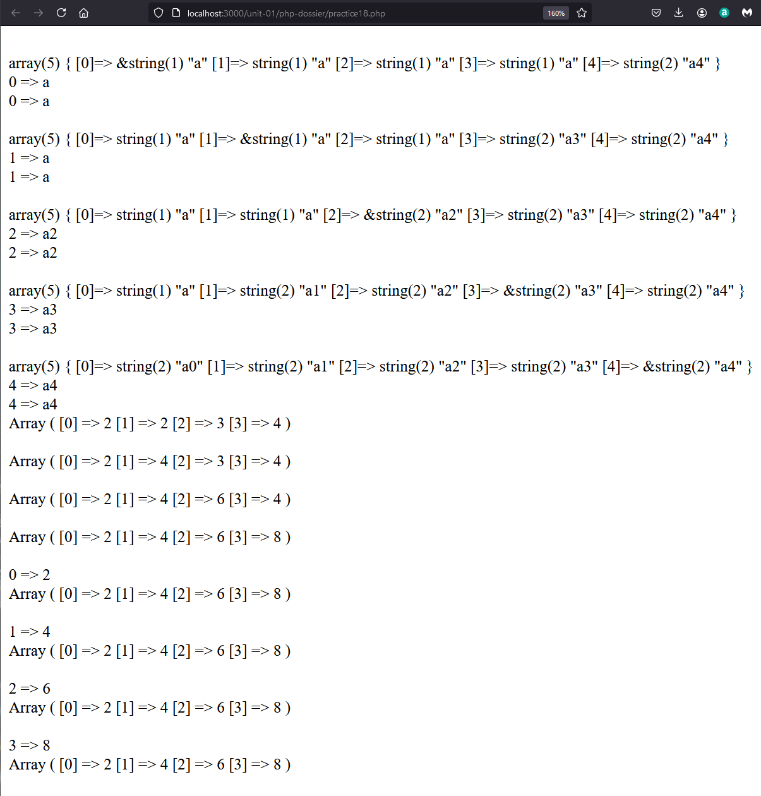
</div>

***
</br>

## Práctica 19

> 📂
> Ejecutar el script anterior. Tomar captura de pantalla del resultado
>

- Código:

```
<?php
    $array = ["a","a","a","a","a"];
    $j=count($array);
    foreach( $array as $key => &$val){
        $j--;
        $array[$j] .= $j;
        echo "<br>";
        var_dump($array);
        echo "<br> $key => $val";
        echo "<br> $key => $array[$key]";
        echo "<br>";
    }
?>
```

- Captura:

<div align="center">
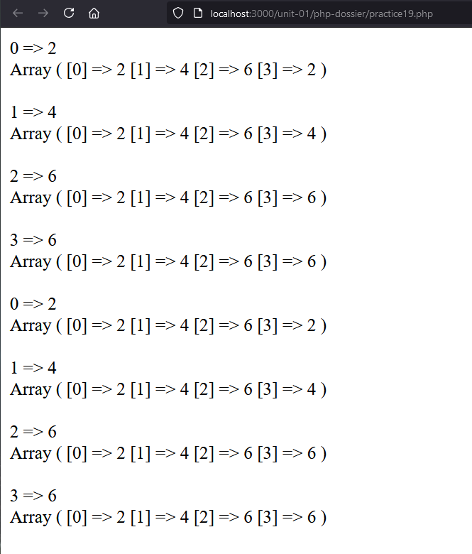
</div>

***
</br>

## Práctica 20

> 📂
> Ejecutar el script anterior. ¿ qué valor devuelve ?Tomar captura de pantalla
>

- Código:

```
<?php
    $arr= ["1","2","3","4"];
    $va = array_pop($arr);
    echo "el array ahora queda: <br>";
    print_r($arr);
    echo "<br>el valor extraido es: " . $va;
?>
```

- Captura:

<div align="center">
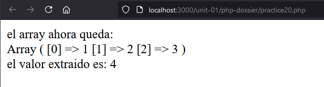
</div>

***
</br>

## Práctica 20

> 📂
> Ejecutar el script anterior. ¿ qué valor devuelve ?Tomar captura de pantalla
>

- Código:

```
<?php
    $arr= ["1","2","3","4"];
    $va = array_pop($arr);
    echo "el array ahora queda: <br>";
    print_r($arr);
    echo "<br>el valor extraido es: " . $va;
?>
```

- Captura:

<div align="center">

</div>

***
</br>

## Práctica 21

> 📂
> Crear un script que por medio de un bucle for que vaya de 1 a 10 agregue esos números en un array En cada iteración mostrar el contenido del array. Después en un bucle for de 1 a 5 ir ejecutando sentencias array_pop() y mostrar como queda el array en cada iteración

- Código:

```
<?php   
    $arr = [];

    for($i=0; $i<10; $i++){
        $arr[] = $i;
        echo "Array value $i: ";
        print_r($arr);
        echo "</br>";
    }

    for($j=0; $j<5; $j++){
        $arrPop = array_pop($arr);
        echo "Popped array value $j: ";
        print_r($arr);
        echo "</br>";
        echo "Value popped: " . $arrPop;
        echo "</br>";
    }
?>
```

- Captura:

<div align="center">
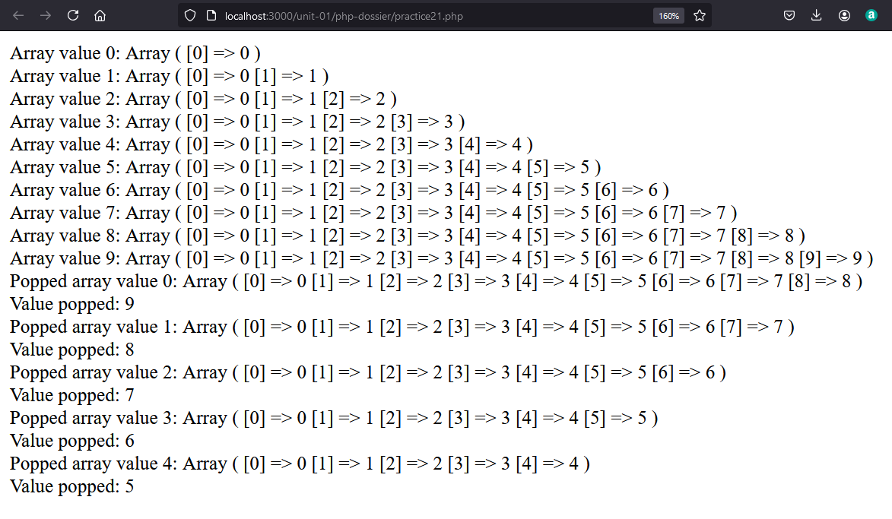
</div>

***
</br>

## Práctica 22

> 📂
> Crear un script que por medio de un bucle for que vaya de 1 a 10 agregue esos
números en un array mediante array_unshift() En cada iteración mostrar el contenido del
array. Después en un bucle for de 1 a 5 ir ejecutando sentencias array_shift() y mostrar
como queda el array en cada iteración

- Código:

```
<?php   
    $arr = [];

    for($i=0; $i<10; $i++){
        $arr[] = $i;
        echo "Array unshift values $i: ";
        print_r($arr);
        echo "</br>";
    }
    
    echo "</br>";

    for($j=0; $j<5; $j++){
        $arrShift = array_shift($arr);
        echo "Shifted array value $j: ";
        print_r($arr);
        echo "</br>";
        echo "Value shifted: " . $arrShift;
        echo "</br>";
    }
?>
```

- Captura:

<div align="center">
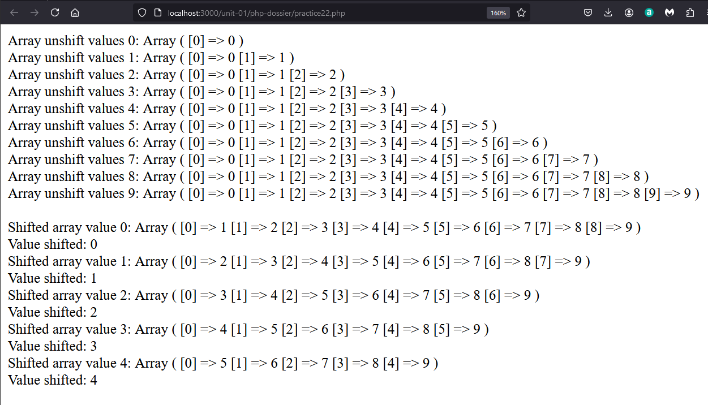
</div>

***
</br>

## Práctica 22

> 📂
> Crear un script que por medio de un bucle for que vaya de 1 a 10 agregue esos
números en un array mediante array_unshift() En cada iteración mostrar el contenido del
array. Después en un bucle for de 1 a 5 ir ejecutando sentencias array_shift() y mostrar
como queda el array en cada iteración

- Código:

```
<?php   
    $arr = [];

    for($i=0; $i<10; $i++){
        $arr[] = $i;
        echo "Array unshift values $i: ";
        print_r($arr);
        echo "</br>";
    }
    
    echo "</br>";

    for($j=0; $j<5; $j++){
        $arrShift = array_shift($arr);
        echo "Shifted array value $j: ";
        print_r($arr);
        echo "</br>";
        echo "Value shifted: " . $arrShift;
        echo "</br>";
    }
?>
```

- Captura:

<div align="center">

</div>

***
</br>

## Práctica 23

> 📂
> Haz una página PHP que utilice foreach para mostrar todos los valores del
array $_SERVER en una tabla con dos columnas. La primera columna debe contener el nombre de la variable, y la segunda su valor

- Código:

```
<?php
    echo "<table>";
    echo "<tr>";
    echo "<th>Var</th>";
    echo "<th>Value</th>";
    echo "</tr>";

    foreach ($_SERVER as $key => $value) {
            echo "<tr>";
            echo "<td>$key</td>";
            echo "<td>$value</td>";
            echo "<tr>";
    }
    
    echo "</table>";
?>
```

- Captura:

<div align="center">
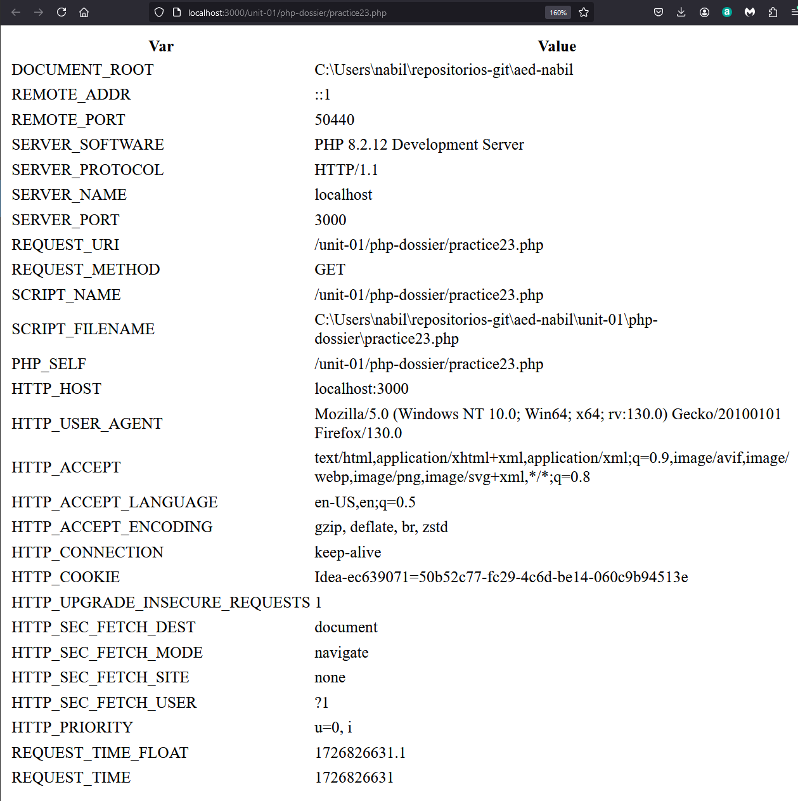
</div>

***
</br>

## Práctica 24

> 📂
> Ejecutar los códigos de in_array(), array_search(), array_values() tomar
captura del resultado de la ejecución

- Código:

```
<?php 
    echo "in_array code:";
    echo "</br>";

    $os = array("Mac", "NT", "Irix", "Linux");
    if (in_array("Irix", $os)) {
        echo "Existe Irix";
    }
    if (in_array("mac", $os)) {
        echo "Existe mac";
    }

    echo "</br>";

    $a = array('1.10', 12.4, 1.13);
    if (in_array('12.4', $a, true)) {
        echo "Se encontró '12.4' con comprobación estricta\n";
    }
    if (in_array(1.13, $a, true)) {
        echo "Se encontró 1.13 con comprobación estricta\n";
    }

    echo "</br>";
    echo "array_search code:";
    echo "</br>";

    $array = array(0 => 'azul', 1 => 'rojo', 2 => 'verde', 3 => 'rojo');
    $clave = array_search('verde', $array);
    echo $clave . "<br>";
    $clave = array_search('marrón', $array);
    if( $clave === FALSE) {
        echo "no se ha localizado el valor";
    } else {
        echo $clave;
    }

    echo "</br>";
    echo "array_values code:";
    echo "</br>";

    $array = array('azul', 'rojo', 'verde', 'amarillo', "blanco");
    unset($array[2]);
    unset($array[3]);
    print_r($array);
    $array = array_values($array);
    echo "</br>";
    print_r($array);
?>
```

- Captura:

<div align="center">
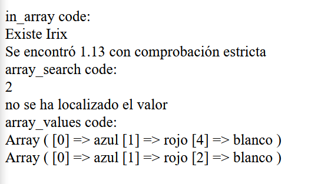
</div>

***
</br>

## Práctica 25

> 📂
> Rellenar un array con 10 números aleatorios entre 20 y 25 ( hacer uso de:
rand ( int $min , int $max ) : int) y luego hacer uso de array_search() para localizar el valor: “22” Se debe mostrar en pantalla el array completo y el valor devuelto por array_search()

- Código:

```
<?php
    $arr = [];
    for ($i = 0; $i < 10; $i++) {
        $arr[$i] = rand (20, 25);
    }

    print_r($arr);

    echo "</br>";

    $key = array_search(22, $arr);
    if( $key === FALSE) {
        echo "Value not found in array";
    } else {
        echo "Value found at index " . $key;
    }
?>
```

- Captura:

<div align="center">
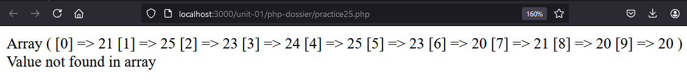
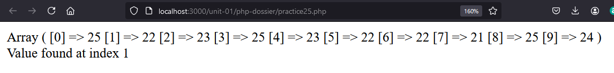
</div>

***
</br>

## Práctica 26

> 📂
> Variar el ejemplo anterior para que se haga uso del operador nave espacial:
<=>

- Código:

```
<?php
    function cmp($a, $b) {
        return $a <=> $b;
    }

    $a = array(3, 2, 5, 6, 1);
    echo "Original array : ";
    print_r($a);
    echo "</br>";

    echo "Sorted array : ";
    usort($a, "cmp");
    foreach ($a as $valor) {
        echo " $valor, ";
    }
?>
```

- Captura:

<div align="center">
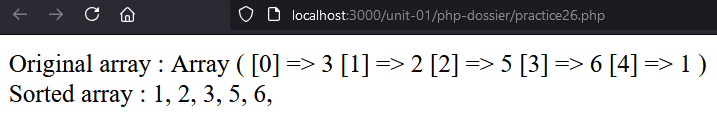
</div>

***
</br>

## Práctica 27

> 📂
> Crear un array con los valores: [7,2,8,1,9,4] Hacer búsqueda con array_search() de: 4. Ordenar el array con usort y repetir la búsqueda de: 4; Mostrar los array antes y después de ordenación así como lo que devuelve array_search()
>

- Código:

```
<?php
    $arr = [7,2,8,1,9,4];

    print_r($arr);
    echo "</br>";

    $key = array_search(4, $arr);
    found($key);

    function found($key) {
        if( $key === FALSE) {
            echo "Value not found in array";
        } else {
            echo "Value found at index " . $key;
        }
    }

    echo "</br>";

    function compare($val1, $val2) {
        return $val1 <=> $val2;
    }

    echo "</br>";
    usort($arr, "compare");
    $sortArr = [];

    foreach ($arr as $value) {
        $sortArr[] = $value;
    }

    print_r($sortArr);
    echo "</br>";

    $key = array_search(4, $sortArr);
    found($key);
?>
```

- Captura:

<div align="center">
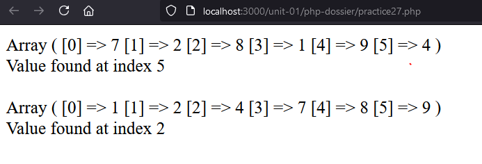
</div>

***
</br>

## Práctica 28

> 📂
> Modifica el código anterior y quita el valor por defecto del parámetro $print. Ejecuta el programa y toma captura de pantalla de los mensajes del IDE y responde: ¿ se obtiene resultado o se detiene el programa ?
>


Al quitar que el valor de "$print" sea false tendremos un error al ejecutarlo, deteniendose el prograsma

- Código:

```
<?php
function sumar($a, $b, $print): float
{
$suma = $a + $b;
if ($print) {
echo "resultado suma: $suma <br>";
}
return $suma;
}
$sum1=sumar(1,2);
$sum2=sumar(4,5,true);
echo "las operaciones para sum1 y sum2 dan: $sum1 , $sum2";
?>
```

- Captura:

<div align="center">
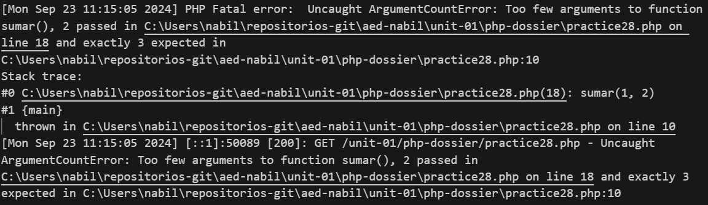
</div>

***
</br>


## Práctica 29

> 📂
> Probar el código anterior. Observamos que no se ha modificado el valor de la variable después de la ejecución de la función Así que ¿ estamos en un caso de paso por valor o por referencia ? Tomar captura de pantalla
>

Podemos observar como los cambios que gacemos dentro de la función no influyen en el valor de la variable, por lo tanto estamos ante un caso de paso por valor.

- Código:

```
<?php
    function modify(int $a): void {
        $a = 3;
    }
    $a = 2;
    modify($a);
    print_r($a);
?>
```

- Captura:

<div align="center">

</div>

***
</br>

## Práctica 30

> 📂
> Ejecutar el ejemplo y observar que ahora la variable sí se ve modificada.
Tomar captura de pantalla
>

- Código:

```
<?php
    function modify(int &$a): void {
        $a = 3;
    }
    $a = 2;
    modify($a);
    print_r($a);
?>
```

- Captura:

<div align="center">
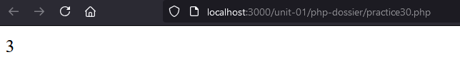
</div>

***
</br>

## Práctica 31

> 📂
> Hacer lo anterior, comprobar el resultado. Ahora debiera mostrar todos los
datos del array. Tomar captura de pantalla.
>

- Código:

```
<?php
    function modify(array &$arr): void {
        $arr[] = 4;
    }
    $a = [1];
    modify($a);
    print_r($a);
?>
```

- Captura:

<div align="center">
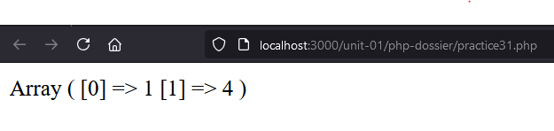
</div>

***
</br>

## Práctica 32

> 📂
> Hacer lo anterior, pero usando require en lugar de include. Para que se note la diferencia la llamada de require debiera ser a un nombre de fichero incorrecto. Por ejemplo haremos que llame a: vars1.php cuando como sabemos el fichero es vars.php
Tomar captura de pantalla
>

- Código:

```
<?php
    echo "Una $fruta $color"; 
    require 'vars1.php';
    echo "Una $fruta $color"; 
?>
```

- Captura:

<div align="center">
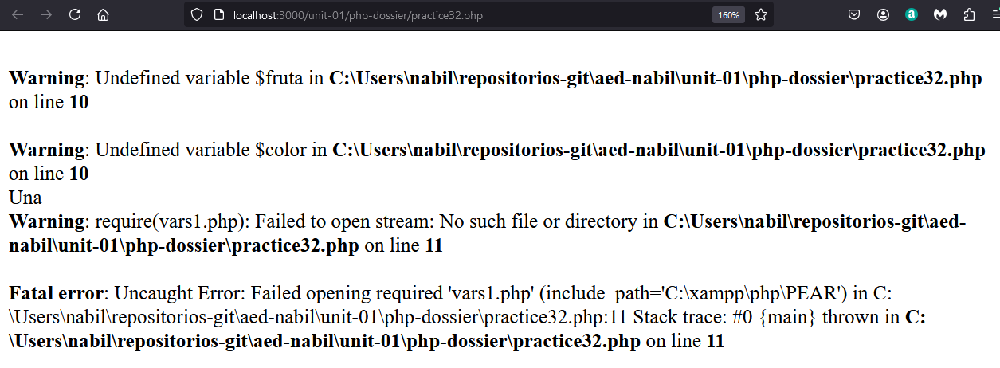
</div>

***
</br>

## Práctica 33

> 📂
> Hacer lo anterior, pero se debe comprobar la diferencia de pasar el texto con urlencode y sin urlencode. Así que se propone poner dos parámetros: prueba y prueba2 unode ellos con urlencode y el otro sin él pasando en ambos casos el mismo texto en el value. Tomar captura de pantalla de lo obtenido
>

- Código:

```
<?php


?>
```

- Captura:

<div align="center">

</div>

***
</br>


## Práctica 34

> 📂
> Recorrer el array $_GET con un foreach y mostrar el conjunto de clave valor
para la actividad anterior
>

- Código:

```
<?php


?>
```

- Captura:

<div align="center">

</div>

***
</br>

## Práctica 35

> 📂
> Realiza una página con un formulario que se llame a si misma para mostrar la
tabla de un número introducido por el usuario. Se deberá controlar que el usuario haya
introducido un número entero positivo. Hacer uso para ello de la función: is_int()
buscando su funcionamiento en el manual oficial: php.net
>

Tras haber consultado en php.net, he concluido que debemos de utilziar is_numeric() en vez de is_int() ya que esta última no identifica los string con contenido númerico como como son los inputs de los formularios y nunca se cumpliría la condición.

- Código:

```
<!DOCTYPE html>
<html lang="en">
<head>
    <meta charset="UTF-8">
    <meta name="viewport" content="width=device-width, initial-scale=1.0">
    <title>Document</title>
</head>
<body>
    <form action="practice35.php" method="post">
        <input type="text" id="num" name="num"> 
        <input type="submit" id="submitNum" name="submitNum" value="Send"> <!-- id client, js || name server--> 
    </form>

    <?php

        if (empty($_POST["num"]) || !is_numeric($_POST["num"])){
            echo "Please enter a valid integer num.";
            exit();
        }   

        $numMulti = $_POST["num"]; 

        if ($numMulti < 1){
            echo "Num must be positive.";
            exit();  
        }

        echo "Recived last petition </br>";
        echo "Num send: ". $numMulti. "</br>";


        function multiplicationTables($num) {
            for ($i = 1; $i <= 10; $i++) {
                $result = $num * $i;	
                echo "$num *  $i  = ". $result. "</br>"; 
            }
        }

        echo "</br>";
        multiplicationTables($numMulti);
    ?>
</body>
</html>
```

- Captura:

<div align="center">
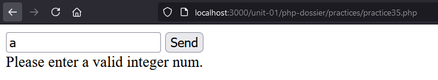
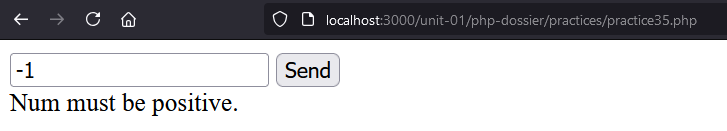
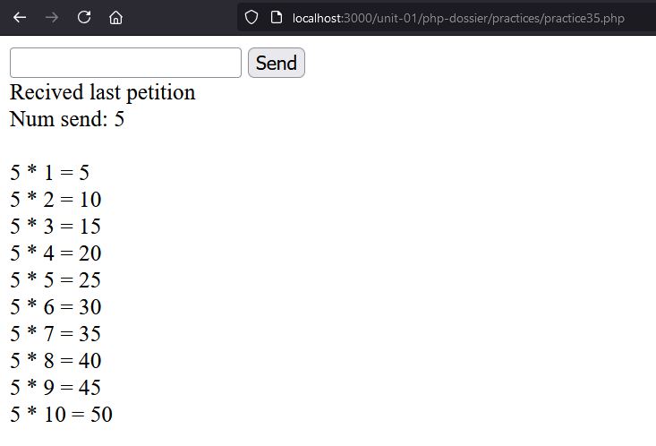
</div>

***

</br>

## Práctica 36

> 📂
> Realizar una página con un formulario que se llame a si misma donde el
usuario introduzca en un input una cadena de números separada por espacios ( ej: 2 5 8 7 3
4 ) y muestre un número por línea, mostrando primero los números impares y luego los
pares. ( hacer uso de la función usort() y de la función explode() )
>

- Código:

```
<form action=<?php echo htmlspecialchars($_SERVER["PHP_SELF"]);?> method="post">
        <input type="text" id="num" name="num"/>
        <input type="submit" id="submit" name="submit" value="Send"/>
    </form>

<?php
    if(!isset($_POST["num"]) || empty($_POST["num"])) {
       exit();
    }

    $numsUser = $_POST["num"];
    $numArray = explode(" ", $numsUser); // same as java split

    foreach ($numArray as $num) {
        if (!is_numeric($num)) {
            echo "Error: All values must be numbers.";
            exit();
        }
    }

    usort($numArray, function($a, $b) {
        if (!($a % 2 == 0) && ($b % 2 == 0)) {
            return -1;
        } elseif (($a % 2 == 0) && !($b % 2 == 0)) {
            return 1;
        } else {
            return 0;
        }
    });

    echo "<p> Sorted array: </p>";  
    foreach($numArray as $num) {
        echo $num. "<br></br> ";
    }

?>
```

Si enviamos valores como: "1 a 2" tendremos un error ya que todos los elementos deben de ser numéricos.

- Captura:

<div align="center">
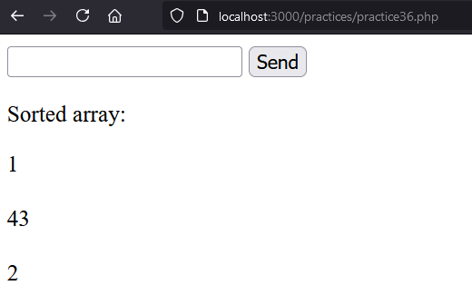
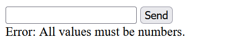
</div>

***

</br>

## Práctica 37

> 📂
> Realizar una página como la anterior que se valide a si misma. Obligando que
el correo sea válido, que el nombre no sea vacío al igual que el género. Si los datos están
correctamente introducidos se mostrarán por debajo de “Datos ingresados” si no superan la
validación se dirá los campos que no la superan con texto en rojo

- Código:

```

```

- Captura:

<div align="center">


</div>

***

</br>


## Formulario - Descomponer Número

> 📂
> 

- Código:

```

```

- Captura:

<div align="center">

</div>

***

</br>

## Formulario - Tablas

> 📂
> 

- Código:

```

```

- Captura:

<div align="center">

</div>

***

</br>

</div>
