<div align="justify">

## PHP Dossier 

- [Práctica 01](./php-dossier/practice01.php)
- [Práctica 02](./php-dossier/practice02.php)
- [Práctica 03](./php-dossier/practice03.php)
- [Práctica 04](./php-dossier/practice04.php)
- [Práctica 05](./php-dossier/practice05.php)
- [Práctica 06](./php-dossier/practice06.php)
- [Práctica 07](./php-dossier/practice07.php)
- [Práctica 08](./php-dossier/practice08.php)
- [Práctica 09](./php-dossier/practice09.php)
- [Práctica 10](./php-dossier/practice10.php)
- [Práctica 11](./php-dossier/practice11.php)
- [Práctica 12](./php-dossier/practice12.php)


***

### Práctica 01

> 📂 
> Crear el script como se ha comentado sustituyendo “alumno” por nuestro
nombre completo. Tomar captura de pantalla del resultado
>

- Captura:
<div align="center">
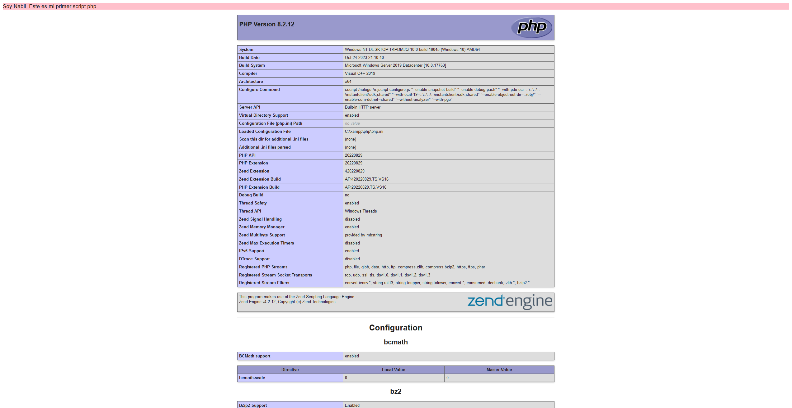
</div>

***
</br>

### Práctica 02

> 📂 
> Crear el script anterior. Modificarlo para sumar a $un_str el valor de $un_int y mostrarlo en pantalla ¿ qué ocurre ?
>

Podemos observar como la operación no se puede realizar porque los dos variables que estamos sumando son de distintos tipos.

- Captura:

<div align="center">
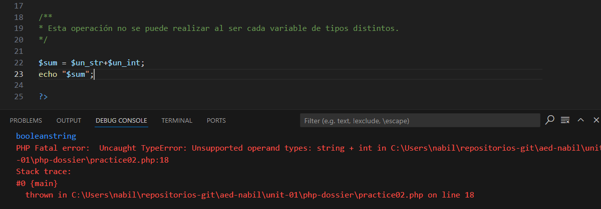
</div>


</br>

> 📂 
> Sumar $un_str con $un_str2 ¿ qué ocurre ?
>

No se nos permite concatener cadenas de texto utilizando operadores como '+' al contrario que en Java.

- Captura:
<div align="center">
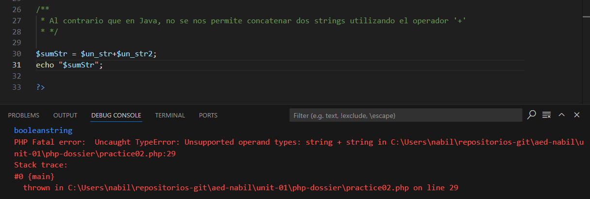
</div>

</br>

> 📂 
> ¿ Se puede concatenar una cadena con comillas
simples con una con comillas dobles ?
>

Gracias al operador '.' nos es posible concatener cadenas de texto sin importar si estas son de comillas simples o dobles.

- Captura:

<div align="center">
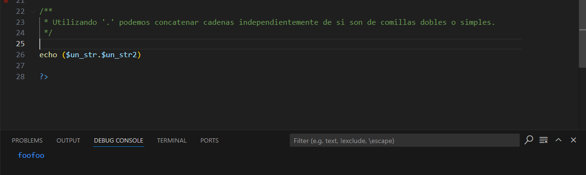
</div>

***

</br>

## Práctica 03

> 📂 
> Realizar el código anterior y tomar captura de pantalla del resultado. ¿ qué es lo
que ha ocurrido ?
>

Se nos muestra el parrafo del echo. La suma se visualiza gracias al uso del print en vez de a la declaración de la variable resultado.

- Captura:

<div align="center">
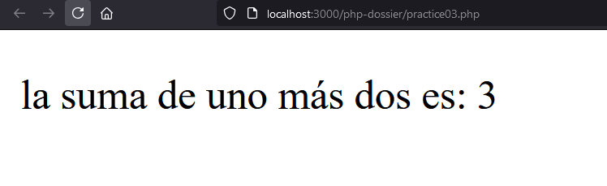
</div>

</br>

> 📂 
> Poner código html antes de la declaración de strict_types y probar de
nuevo ¿ qué ocurre ahora ?
>

Tenemos un error, ya que las declaraciones de strict_types deben ser lo primero en nuestro fichero php.

- Captura:

<div align="center">
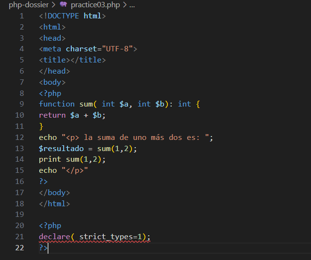
</div>

***
</br>

## Práctica 04

> 📂 
> ¿ Da error ? ¿ Por qué ?
>

Al probar el código proporcionado, observamos que no hay error y en efecto la función funciona correctamente. Esto es debido a que estamos devolviendo un resultado que tiene el tipo de variable que se espera.

- Captura:

<div align="center">
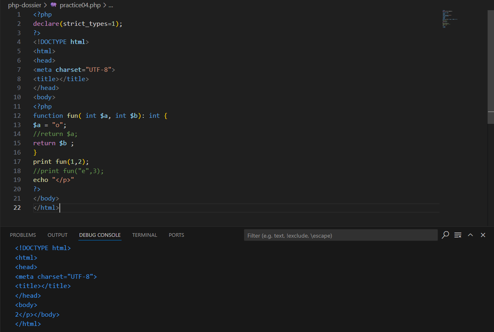
</div>

</br>

> 📂 
> Quitar el comentario a: return $a; ¿ Da error ahora ? ¿ Por qué ?
>

Al realizar el cambio, nos encontramos con un error puesto que en la función igualamos '$a' a una cadena de texto y al ahora retornar este argumento en vez de '$b' tenemos un error, ya que la propia función especifica que devuleve un valor entero.

- Captura:

<div align="center">
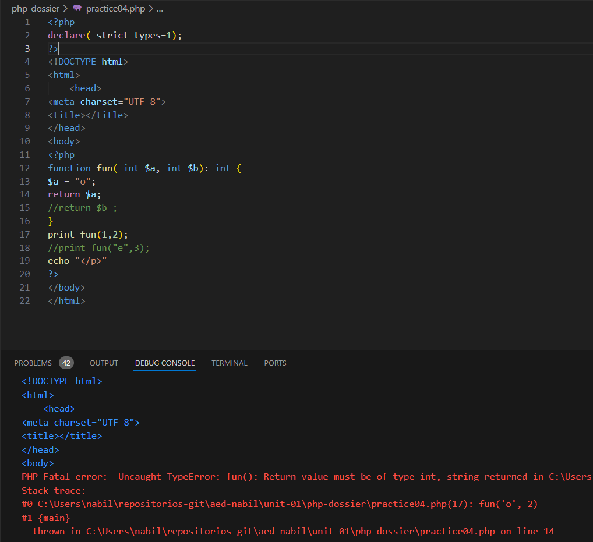
</div>

</br>

> 📂 
> Quitar comentario a: print fun(“e”,3); ¿ Da error ?
>

Tras realizar este cambio, también tenemos un error. En este caso es por pasarle por parametros a la función un tipo de dato distinto al esperado.

- Captura:

<div align="center">
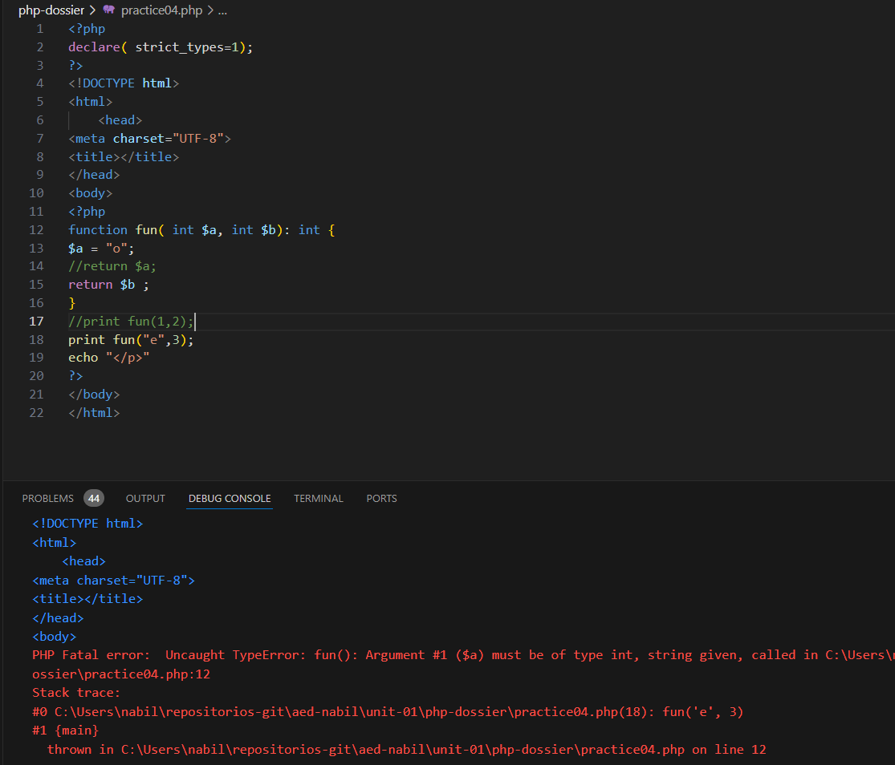
</div>

***
</br>

## Práctica 05

> 📂 
> Probar el código anterior. Probar ahora con números ¿ también funcionan las referencias ?
>

Originalmente funciona de esta manera.
- Captura:

<div align="center">
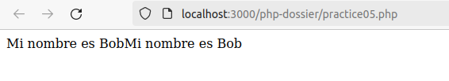
</div>


Al realizar el cambio a valores númericos se muestra de la siguiente forma, donde podemos apreciar que sigue funcionando;

- Captura:

<div align="center">
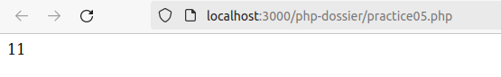
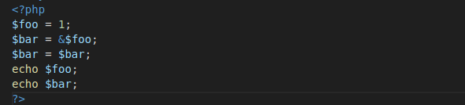
</div>

***
</br>

## Práctica 05.5

> 📂 
> Crear un array: $mivar = []; Introducir datos: array_push($mivar,”uno”); y hacer una asignación a otras variables. Una por referencia y la otra por valor: $arr1 = $mivar; $arr2 = &$mivar; modificar la posición cero de esas variable : $arr1[0] = “una variación”; $arr2[0] = “variando array2 ”; y mostrar el contenido de $mivar[0] y $arr1[0] ¿ qué es lo que ha ocurrido ? ( tomar captura de pantalla y explicarlo )
>


- Captura:

<div align="center">
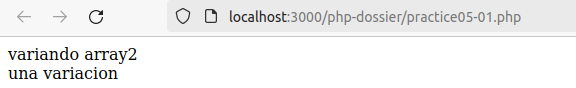
</div>

***
</br>

## Práctica 06

> 📂 
> Hacer un script php que haga echo de $_SERVER y de $_SERVER
[PHP_SELF] tomar captura de pantalla de los resultados
>

- Código:
```
<?php
    var_dump ($_REQUEST);  
    var_dump ($_SERVER["SERVER_NAME"]);
    var_dump ($_SERVER[PHP_SELF]);  
?>
```

- Captura:
<div align="center">
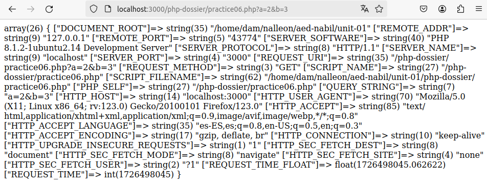
</div>


***
## Práctica 07

> 📂 
> Visualizar lo anterior ¿ se encuentran diferencias entre null y unset() ? Tomar
captura de pantalla
>

- Código:
```
<?php
    $variable = null;
    var_dump($variable);
    echo "</br>";
    unset($variable);
    var_dump($variable);
?>
```

A simple vista, podemos apreciar como establpecer un valor nulo en la variable simplemente lo define como tal mientras que si utilizamos unset se nos especifica donde hemos dejado la variable nula.

- Captura:
<div align="center">
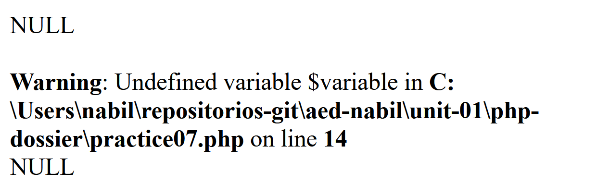
</div>


***
</br>

## Práctica 08

> 📂 
> Ejecutar el script anterior ¿ hay alguna diferencia antes y después del cast ?
Tomar captura de pantalla
>

- Código:
```
<?php
    $unavar = 1.3;
    var_dump($unavar);
    echo "<br>";
    $unavar = (int) $unavar;
    var_dump($unavar);
?>
```

Podemos apreciar una diferencia clara puesto que el valor de '$unavar' a cambiado de un  float a un entero por lo que ha perdido su parte decimal al truncarse.

- Captura:
<div align="center">
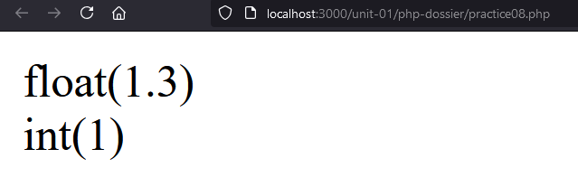
</div>

***
</br>

## Práctica 08.5

> 📂 
> ¿ Qué ámbito tienen las constantes ? ¿ realmente no se puede poner varios
valores en un constante ?
>

Las constantes tienen un ámbito global, es decir que se puede acceder a ellas unas vez declaradas desden cualquier método del scripts. Una vez ya hayamos declarado el valor de una constante no podremos redefinirlo o modificarlo.


> 📂 
> Probar fuera de una función a crear constante:
const PULGADA = 2.53; ahora tratar de establecerla de nuevo mediante: PULGADA = 7; const PULGADA = 8; $PULGADA = 9; hacer echo en cada caso.
>
- Código:
```
<?php
    const PULGADA = 2.53;
    var_dump(PULGADA);
    echo "</br>";
    const PULGADA = 8;
    var_dump(PULGADA);
    echo "</br>";
    $PULGADA = 9;
    var_dump(PULGADA);
?>
```

> 📂 
>Crear la constante en ámbito global ( fuera de función ) ¿ se puede acceder dentro de una función ? ¿ se puede establecer: const PULGADA = 10 dentro de una función ?
Tomar capturas de pantalla en cada caso y explicar lo que ha ocurrido
>


- Código:
```
<?php
    const PULGADA = 2.53;
    
    function testConstants(){
        //const PULGADA_LOCAL = 10; NO se pueden establecer dentro de una función
        return PULGADA;
    }
?>
```
Si hemos creado la variable globalmente no tendremos problema en llamarla dentro de una función para utilizarla, en cambio si intentamos declarar en este caso la constante 'PULGADA_LOCAL' dentro de la función tendremos un error de sintaxis.

- Captura:
<div align="center">
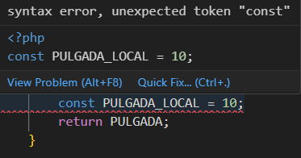
</div>

***
</br>

## Práctica 09

> 📂 
> Crear un script que muestre las potencias del número 2 desde 2¹ hasta 2⁹ hacer
uso del operador: ** Ir concatenando las salidas en pantall de las potencias en una string mediante el operador de concatenación y asignación: .=
>

- Código:
```
<?php
    function exponentation(){
        $num = 2;
        for($i = 0; $i < 10; $i++){
            $str = $num;
            $str .= "^".$i;
            echo $str. " = ". ($num**$i). "<br>";
        }
    }   

    exponentation(); 
    echo "<br>";
?>
```

- Captura:
<div align="center">
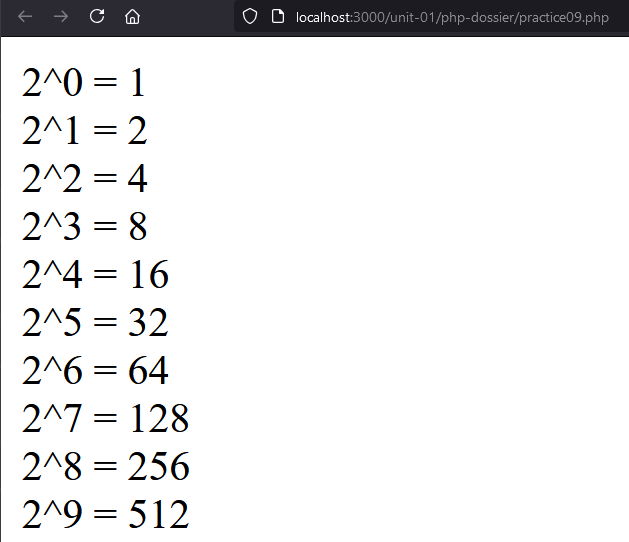
</div>

***
</br>

## Práctica 10

> 📂 
> Crear un programa en php que obtenga la descomposición de un número que
esté almacenado en la variable: $numero Por ejemplo: $numero = 3102 Se pretende que se utilicen en el programa los operadores: .= , **. Para el ejemplo anterior se debe mostrar en pantalla: 2 * 1 + 0 * 10 + 1 * 100 + 3 * 1000
>

- Código:
```
<?php

function decompositionNum($num) {
    $numAux = $num;

    $units = (int) $numAux % 10;
    $numAux = (int) ($numAux / 10);
    $tens = (int) $numAux % 10;
    $numAux = (int) ($numAux / 10);
    $hundreds = (int) $numAux % 10;
    $numAux = (int) ($numAux / 10);
    $thousand = (int) $numAux % 10;

    return $units . " * 1 + " . $tens . " * 10 + " . $hundreds . " * 100 + " . $thousand . " * 1000";    
}

echo decompositionNum(3102);

?>
```

- Captura:
<div align="center">
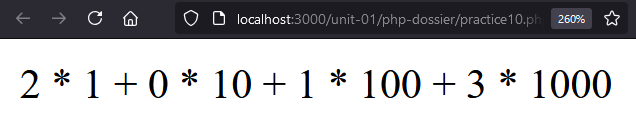
</div>

***
</br>

## Práctica 11

> 📂 
> Ejectuar el script y tomar captura de pantalla
>

- Código:
```
<?php
$var = "";
    if(empty($var)){ // true because "" is considered empty
        echo '<br>empty($var) para $var="" ';
    }else{
        echo '<br>!empty($var) para $var="" ';
    }

    if(isset($var)){ //true because var is set
        echo '<br>isset($var) para $var="" ';
    }else{
        echo '<br> !isset($var) para $var="" ';
    } if(empty($otherVar)){ //true because $otherVar is null
        echo '<br>empty($otherVar) para $otherVar que no se ha establecido ';
    } else {
        echo '<br> !empty($otherVar) para $otherVar que no se ha establecido ';
    }
    if(isset($otherVar)){ //false because $otherVar is not set
        echo '<br>isset($otherVar) para $otherVar que no se ha establecido ';
    } else {
        echo '<br> !isset($otherVar) para $otherVar que no se ha establecido ';
    }
?>
```

- Captura:
<div align="center">
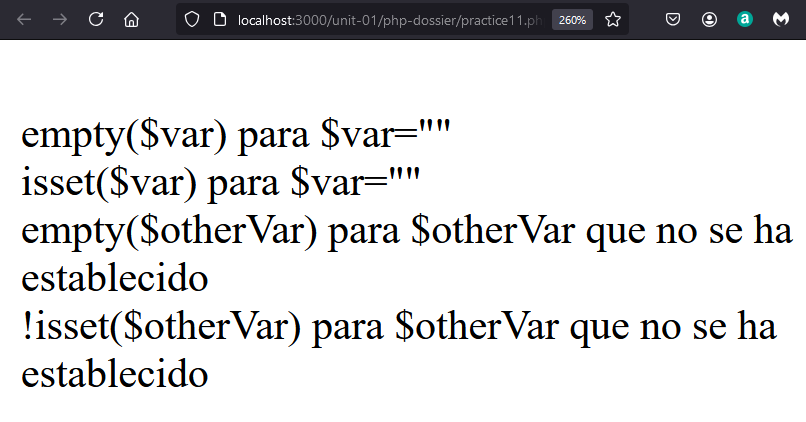
</div>

***
</br>

## Práctica 12

> 📂 
>Probar el script anterior y observar que ocurre. ¿ qué mensaje de error se observa ?
>

- Código:
```
<?php
    $array = array('uno' =>1, 'dos'=>2, 'tres'=>40, 'cuatro'=>55);
    $str = "La posición 'tres' contiene el dato $array['tres']";
?>
```
Se nos muestra un error de sintax al estar llamando a la variable '$array' de esta forma.
- Captura:
<div align="center">
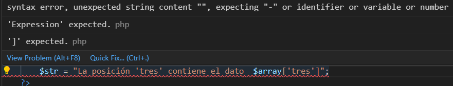
</div>

Para poder solucionarlo debemos de utilizar la siguiente sintaxis:

```
<?php
    $array = array('uno' =>1, 'dos'=>2, 'tres'=>40, 'cuatro'=>55);
    $str = "La posición 'tres' contiene el dato {$array['tres']}";
?>
```

***
</br>

## Práctica 13

> 📂 
> Probar el script anterior y observar que ocurre. Probar ahora con llaves:
${$variable} ¿ hay diferencia ?
>

- Código:
```
<?php
    $variable = 'dato';
    $dato = 5;
    echo ${$variable}.'<br>';
?>
```

No hay ninguna diferencia, se nos sigue mostrando el valor de '$dato' como 5;
- Captura:
<div align="center">
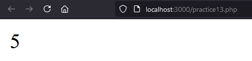
</div>


***
</br>

## Práctica 14

> 📂 
> Toma el código anterior e introduce una expresión “variable de variables” que
permita definir las variables: $dato0, $dato1, …, $dato9 Cada una de ellas con el valor
correspondiente: 0, 1,…,9
>

- Código:
```
<?php
    $var = 'dato';
    for($i=0; $i<10; $i++){
        ${$var.$i} = $i;
    }
    echo "<br> ${'dato0'} ";
    echo "<br> ${'dato1'} ";
    echo "<br> ${'dato2'} ";
    echo "<br> ${'dato3'} ";
    echo "<br> ${'dato4'} ";
    echo "<br> ${'dato5'} ";
    echo "<br> ${'dato6'} ";
    echo "<br> ${'dato7'} ";
    echo "<br> ${'dato8'} ";
    echo "<br> ${'dato9'} ";
?>
```

- Captura:
<div align="center">
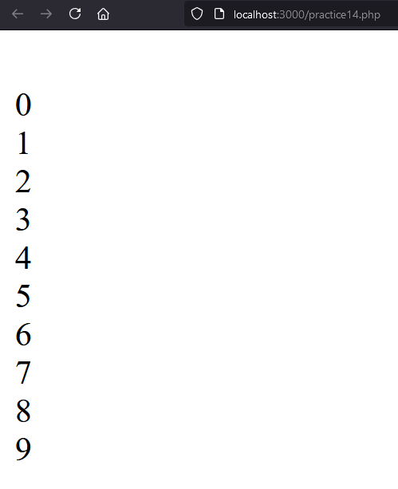
</div>


***
</br>

## Práctica 15

> 📂 
> Ejecutar el script anterior ¿ se muestran las posiciones anteriores a la 2 ? ¿ y
entre la 2 y la 7 ?. Realizar el mismo script pero en lugar de crear el array mediante los
corchetes: $array = [] hacerlo con la función array() ¿ hay diferencias en la salida en
pantalla ? Ejecutar var_dump($array) después de cada asignación de un valor al array.
Tomar captura de pantalla de los resultados
>

- Código:
```
<?php
    $array = [];
    $array[2]="mensaje";
    $array[7]="lalala!";
    $array[]="yepa yepa!!";
    var_dump($array);
?>
```
+
NO se muestran las posiciones anteriores a la 2 ni entre esta y la 7, puesto que están vacias.

- Captura:
<div align="center">
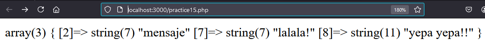
</div>

</br>

> 📂 
> Realizar el mismo script pero en lugar de crear el array mediante los
corchetes: $array = [] hacerlo con la función array() ¿ hay diferencias en la salida en
pantalla ? Ejecutar var_dump($array) después de cada asignación de un valor al array.
Tomar captura de pantalla de los resultados
>

- Código:
```
<?php
    $array = [];

    $array[2]="mensaje";
    var_dump($array);
    echo "</br>";


    $array[7]="lalala!";
    var_dump($array);
    echo "</br>";


    $array[]="yepa yepa!!";
    var_dump($array);
    echo "</br>";

    $array2 = array();
    $array2[2]="mensaje";
    var_dump($array2);
    echo "</br>";

    $array2[7]="lalala!";
    var_dump($array2);
    echo "</br>";

    $array2[]="yepa yepa!!";
    var_dump($array2);

?>
```

- Captura:
<div align="center">
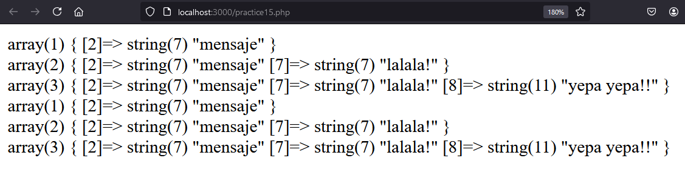
</div>

***
</br>

## Práctica 15.5

> 📂 
> Crear un array asociativo dejando sin poner en algunas ocasiones la parte de la clave dejando únicamente el valor ( al estilo de si fuera un array no asociativo ) hacer un var_dump() y recorrerlo con un for ( no con un foreach) ¿ muestra algún valor ? ¿ genera error ?
>

- Código:
```
<?php
    $array = [];
    $array[2]="mensaje";
    $array[7]="lalala!";
    $array[]="yepa yepa!!";

    echo "<br>";

    for($i = 0; $i < 9; $i++){
        if(isset($array[$i])){
            var_dump($array[$i]);
        } 
    }
?>
```

Muestra correctamente valor con su clave asociada sin generar errores.


- Captura:
<div align="center">
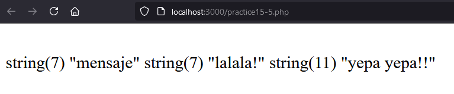
</div>

***
</br>

> 📂 
> Realizar el mismo script pero en lugar de crear el array mediante los
corchetes: $array = [] hacerlo con la función array() ¿ hay diferencias en la salida en
pantalla ? Ejecutar var_dump($array) después de cada asignación de un valor al array.
Tomar captura de pantalla de los resultados
>

- Código:
```
<?php


?>
```

- Captura:
<div align="center">

</div>

***
</br>

</div>