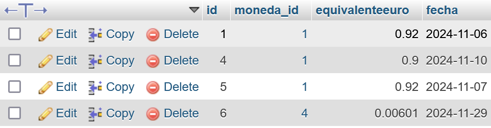
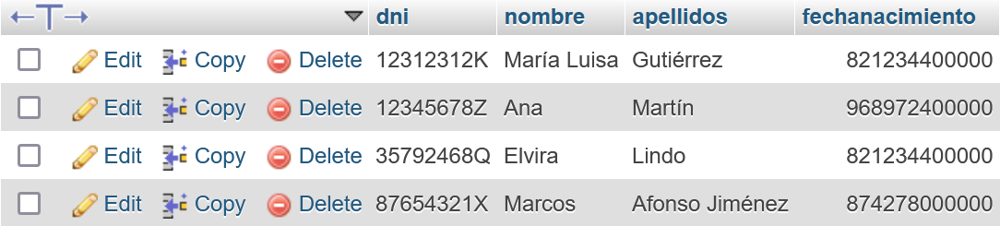
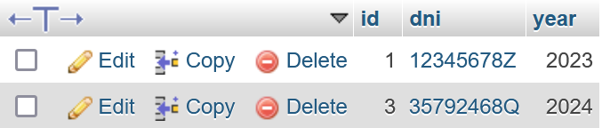
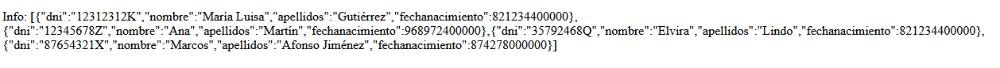

<div align="justify">

## Eloquent Dossier

- [Práctica 01](#práctica-01)
- [Práctica 02](#práctica-02)
- [Práctica 03](#práctica-03)
- [Práctica 04](#práctica-04)
- [Práctica 05](#práctica-05)
- [Práctica 06](#práctica-06)
- [Práctica 07](#práctica-07)
- [Práctica 08](#práctica-08)
- [Práctica 09](#práctica-09)
- [Práctica 10](#práctica-10)
- [Práctica 11](#práctica-11)
- [Práctica 12](#práctica-12)
- [Práctica 13](#práctica-13)
- [Práctica 14](#práctica-14)
- [Práctica 15](#práctica-15)
- [Práctica 16](#práctica-16)
- [Práctica 17](#práctica-17)
- [Práctica 18](#práctica-18)
- [Práctica 19](#práctica-19)
- [Práctica 20](#práctica-20)
- [Práctica 21](#práctica-21)
- [Práctica 21.1](#práctica-211)
- [Práctica 22](#práctica-22)
- [Práctica 23](#práctica-23)

***

### Práctica 01

> 📂
> Crear un elemento del modelo mediante php artisan para luego guardarlo en
sqlite. En concreto crearemos: Alumno ( para esta prueba lo único que guardaremos será el
nombre apellidos y edad )
>


```php
<?php

namespace App\Models;

use Illuminate\Database\Eloquent\Factories\HasFactory;
use Illuminate\Database\Eloquent\Model;

class Alumno extends Model{
    use HasFactory;
    /**
     * @var string
     */
    private $name;
    /**
     * @var string
     */
    private $surname;
    /**
     * @var int
     */
    private $age;

    //constructor
    public function __construct() {
        $this->name = "";
        $this->surname = "";
        $this->age = 1;
    }

    //getters and setters
    public function getName(): string {
        return $this->name;
    }
    public function setName(string $name): void {
        $this->name = $name;
    }
    public function getSurname(): string {
        return $this->surname;
    }
    public function setSurname(string $surname): void {
        $this->surname = $surname;
    }
    public function getAge(): int {
        return $this->age;
    }
    public function setAge(int $age): void {
        $this->age = $age;
    }
}
```

***
</br>

### Práctica 02

> 📂
> Realizar la migración para Alumno ( para esta prueba lo único que
guardaremos será el nombre apellidos y edad ) Comprobar mediante el addon sqlite que se
ha creado en la database
>

```php
<?php

use Illuminate\Database\Migrations\Migration;
use Illuminate\Database\Schema\Blueprint;
use Illuminate\Support\Facades\Schema;

return new class extends Migration
{
    /**
     * Run the migrations.
     */
    public function up(): void
    {
        Schema::create('alumnos', function (Blueprint $table) {
            $table->id();
            $table->timestamps();
            $table->string('name',30)->nullable(false);
            $table->string('surename');
            $table->integer('age');
        });
    }

    /**
     * Reverse the migrations.
     */
    public function down(): void
    {
        Schema::dropIfExists('alumnos');
    }
};

```

- Captura:

<div align="center">

</div>

</br>

### Práctica 03

> 📂
> Haciendo uso de la documentación oficial y ejecutando las migraciones Crear
una tabla Productos con string nombre y también un campo llamado precio que soporte
precios con decimales. Así como un campo cantidad que represente la cantidad de producto
de la que disponemos
>

```php
<?php

namespace App\Models;

use Illuminate\Database\Eloquent\Factories\HasFactory;
use Illuminate\Database\Eloquent\Model;

class Productos extends Model
{
    public $timestamps = false;
    
    use HasFactory;
    /**
     * @var string
     */
    private $name;
    /**
     * @var float
     */
    private $price;
    /**
     * @var integer
     */
    private $quantity;

    /**
     * Default constructor
     */
    public function __construct() {
        $this->name = "";
        $this->price = 0.0;
        $this->quantity = 0;
    }

    /**
     * Get the product's name.
     *
     * @return string
     */
    public function getName(): string
    {
        return $this->name;
    }

    /**
     * Set the product's name.
     *
     * @param string $name
     */
    public function setName(string $name): void
    {
        $this->name = $name;
    }

    /**
     * Get the product's price.
     *
     * @return float
     */
    public function getPrice(): float
    {
        return $this->price;
    }

    /**
     * Set the product's price.
     *
     * @param float $price
     */
    public function setPrice(float $price): void
    {
        $this->price = $price;
    }

    /**
     * Get the product's quantity.
     *
     * @return integer
     */
    public function getQuantity(): int
    {
        return $this->quantity;
    }

    /**
     * Set the product's quantity.
     *
     * @param integer $quantity
     */
    public function setQuantity(int $quantity): void
    {
        $this->quantity = $quantity;
    }
}
```

- Migracion:

```php
<?php

use Illuminate\Database\Migrations\Migration;
use Illuminate\Database\Schema\Blueprint;
use Illuminate\Support\Facades\Schema;

return new class extends Migration
{
    /**
     * Run the migrations.
     */
    public function up(): void
    {
        Schema::create('productos', function (Blueprint $table) {
            $table->id();
            $table->timestamps();
            $table->string('name', 50)->nullable(false);
            $table->float('price', 10, 2)->nullable(false);
            $table->integer('quantity')->nullable(false);
        });
    }

    /**
     * Reverse the migrations.
     */
    public function down(): void
    {
        Schema::dropIfExists('productos');
    }
};
```

- Captura:

<div align="center">

</div>

</br>

### Práctica 04

> 📂
> Esta es una práctica de autoformación. Buscar como hacer uso de los: “seeder”
y rellenar datos aleatorios en la tabla productos de la base de datos con ese sistema
>

- Version 1:

```php
<?php

namespace Database\Seeders;

use Faker\Factory as Faker;
use Illuminate\Support\Facades\DB;

class ProductosSeeder extends DatabaseSeeder
{
    /**
     * Run the database seeds.
     */
    public function run(): void
    {
        $faker = Faker::create();

        DB::table('productos')->insert([
            'name' => $faker->word, 
            'price' => $faker->randomFloat(2, 1, 20), 
            'quantity' => $faker->numberBetween(1, 100),
        ]);
        
    }
}
```

</br>

### Práctica 05

> 📂
> Hacer los cambios pertinentes en: .env para que la aplicación use la base de datos mysql con las tablas pertinentes para instituto matrículas. Crear con generate:model
las clases correspondientes. Nota: observar que posiblemente haya que borrar las clase Alumno de prácticas anteriores
>

- Captura:

<div align="center">


</div>

</br>

### Práctica 06

> 📂
> Construir la ruta para las peticiones GET a: veralumno que nos lleve a un controlador Este controlador hará la búsqueda por id del alumno y lo enviará a una vista
que mostrará la información
>

- web.php:

```php
Route::get('/practice06/{dni}',[Practice06Controller::class, 'searchByDNI']);
``` 

- Controller:

```php
 public function searchByDNI($dni){
        DB::connection()->enableQueryLog();
        $student = Alumno::find($dni)

        return view('Practice06', compact('student'));
    }
```

- Captura:

<div align="center">

</div>

</br>

### Práctica 07

> 📂
> Modificar la actividad anterior de tal forma que se sepa que está ejecutando en
la base de datos como sentencia. Toma captura de pantalla del dd() obtenido
>


```php
 public function searchByDNI($dni){
        DB::connection()->enableQueryLog();
        $student = Alumno::find($dni);
        $lastQuery = DB::getQueryLog();
        dd($lastQuery);

        return view('Practice06', compact('student'));
    }
```


- Captura:

<div align="center">
    
</div>

</br>

### Práctica 08

> 📂
> Listar todos los alumnos de nuestra base de datos (debe mostrarse en una vista
blade)
>

- Routes:

```php
Route::get('/practice08/findAll',[Practice08Controller::class, 'findAll']);
```

- Controller:
```php
 public function findAll(){
        $students = Alumno::all();
        return view('Practice08', compact('students'));
    }
```

- Captura:

<div align="center">

</div>

</br>

### Práctica 09

> 📂
> Buscar mediante where y mostrar en una vista las matrículas anteriores a 2021
obtener la consulta sql que ejecuta Eloquent en la base de datos
>

- Routes:

```php
Route::get('/practice09',[Practice09Controller::class, 'findByDate']);
```

- Controller:

```php
    public function findByDate(){
        $data = Matricula::where('year', 2021)->get();
        return view('Practice09', compact('data'));
    }   
```

- Captura:

<div align="center">
    
</div>

</br>

### Práctica 10

> 📂
>Continuando con la anterior, ordenaremos las matrículas por fecha y
ejecutaremos un take(1) (seguir el ejemplo de encima: :where(..l)->orderBy(...)->take(1 )
y finalmente terminaremos con un get() Mediante var_dump() o dd() veremos que
estructura nos devuelve. Hacer lo mismo de nuevo pero ahora en lugar de terminar con un
get() terminamos con un first() ¿ da estructuras diferentes ? Nota: observar que la idea de
first es tomar un objeto y get era el conjunto de objetos
>

- Routes:

```php
Route::get('/practice10',[Practice09Controller::class, 'find']);
```

- Controller

```php
    public function find(){
        $dataGet = Matricula::where('year', 2021)
                    ->orderBy('year','desc')
                    ->take(1)
                    ->get();

        $dataFirst = Matricula::where('year', 2021)
                    ->orderBy('year','desc')
                    ->take(1)
                    ->first();

        dd($dataGet, $dataFirst);
    }
```

- Captura:

<div align="center">
    
</div>

</br>


### Práctica 11

> 📂
> Obtener la cantidad total de asignaturas de 1ºDAM y mostrarlo
>

- Routes:

```php
Route::get('/practice11',[Practice11Controller::class, 'find1DAM']);
```

- Controller

```php
    public function find1DAM(){
        $data = Asignatura::where('curso', '1º DAM')->get();   
        return view('Practice11', compact('data'));
    }
```

- Captura:

<div align="center">

</div>

</br>

### Práctica 12

> 📂
> Crear 2 nuevas asignaturas Siguiendo lo que se detallado: Una de 1ºDAM
mediante new Asignatura() y save() y otra de 2ºDAM mediante: Asignatura::create() Se
debe haber especificado mediante: fillable los campos que se aceptan para rellenar en la
DB.
>

- Routes:

```php
Route::get('/practice12',[Practice12Controller::class, 'create']);
```

- Controller:

```php
  public function create(){
        $asignatura = new Asignatura();
        $asignatura->nombre='ETS';
        $asignatura->curso='1º DAM';
        $asignatura->save();

        Asignatura::create([
           'nombre' => 'DAD',
           'curso' => '2º DAM',
        ]);

        
        $data1ro = Asignatura::where('nombre', 'ETS')->get();   
        $data2do = Asignatura::where('nombre', 'DAD')->get();

        return view('practice12', compact('data1ro', 'data2do'));
    }
```

- Captura:

<div align="center">


</div>

</br>

### Práctica 13

> 📂
> Modificar las dos asignaturas anteriores de tal forma que la que era de
primero pase a segundo y viceversa. Finalmente borrar de la base de datos la que sea de
segundo
>

- Routes:

```php
Route::get('/practice13',[Practice12Controller::class, 'modify']);
```

- Controller:

```php
    public function modify(){
        $asignatura2do = null;
        $asignatura2do = Asignatura::find(9); 
        $asignatura2do->nombre='ETS modify';
        $asignatura2do->curso='2º DAM';


        $asignatura2do->save();

        $asignatura1ro = Asignatura::find(10); 
        $asignatura1ro->nombre='DAD modify';
        $asignatura1ro->curso='1º DAM';
        
        $asignatura1ro->save();

        $this->delete($asignatura2do);

        return view('practice13', compact('asignatura2do', 'asignatura1ro'));
    }


    public function delete($asignatura2do){
        $asignatura2do->delete();
    }
```


- Captura:
<div align="center">


</div>

</br>


### Práctica 14

> 📂
> Basándose en el ejemplo anterior ( usando Historico::create ) crear un
histórico para la moneda dólar que sea para la fecha actual al tipo de cambio actual con el
euro
>

- Route:

```php
Route::get('/practice14',[Practice14Controller::class, 'createHistoric' ]);
```

- Controller:

```php
    public function createHistoric(){
        $moneda = new Moneda();
        $moneda->pais = "Estados Unidos";
        $moneda->nombre = "Dolar";
        $moneda->save();

        $newHistoric = new Historico();
        $newHistoric->moneda_id = 1;
        $newHistoric->fecha = '2024-11-06';
        $newHistoric->equivalenteeuro = 0.92;
        $newHistoric->save();

        $historic = Historico::where('moneda_id', 1)->get();
        return view('Practice14', compact('historic'));
    }
```


- Captura:

<div align="center">


</div>

<br>


### Práctica 15

> 📂
>Crear un histórico para la moneda dólar que sea para la fecha de mañana con
tipo de cambio con el euro actual menos un céntimo, usando save() y associate()
>

- Routes:

```php
Route::get('/practice15',[Practice15Controller::class, 'createHistoric15']);
```

- Controller:

```php
    public function createHistoric15(){
        $moneda = Moneda::find(1);

        $newHistoric = new Historico();
        $newHistoric->fecha = '2024-11-07';
        $newHistoric->equivalenteeuro = 0.92;
        $newHistoric->moneda()->associate($moneda);

        $newHistoric->save();

        $historic = Historico::where('id', 5)->get();

        return view('Practice15', compact('historic'));
    }
``` 

- Captura:

<div align="center">

</div>

<br>


### Práctica 16

> 📂
> Crear un histórico para la moneda dólar que sea para la fecha de pasado
mañana con tipo de cambio con el euro actual menos dos céntimos usando save() desde la
entidad Moneda ( siguiendo el ejemplo que acabamos de ver )
>

- Routes:

```php
Route::get('/practice16',[Practice16Controller::class, 'createHistoric']);
```

- Controller:

```php
  public function createHistoric(){
        $dolar = Moneda::find(1);    
        $newDate = date('Y-m-d', strtotime('+2 days'));


        $historicDolar1 = Historico::where('id', 1)->take(1)
        ->first();

        $newValue = $historicDolar1->equivalenteeuro;
        $newValue -= 0.02;
        


        $newHistoric = new Historico();
        $newHistoric->fecha = $newDate;
        $newHistoric->equivalenteeuro = $newValue;

        $dolar->historicos()->save($newHistoric);


        $historic = Historico::where('id', 4)->get();

        return view('Practice16', compact('historic'));
    }
```

- Captura:

<div align="center">

</div>

<br>

### Práctica 17

> 📂
> Crear una moneda: dólar, país australia y guardarla con: create(). Mostrar el
resultado obtenido haciendo una búsqueda por país: australia. Luego modificarla poniendo
en mayúscula Australia usando save(). Toma captura de pantalla que muestre la salida en
pantalla solicitada
>

- Routes:

```php
Route::get('/practice17',[Practice17Controller::class, 'createCurrency']);
Route::get('/practice17-modify',[Practice17Controller::class, 'updateCurrency']);
```

- Controller:

```php
    public function createCurrency(){
        $currency = Moneda::create([
            'pais' => 'australia',
            'nombre' => 'Dolar'
        ]);
    

        return view('Practice17', compact('currency'));
    }

    
    public function updateCurrency(){
        $currency = Moneda::where('pais', 'australia')->first();

        $currency->pais = 'Australia';
        $currency->save();
    
        return view('Practice17', compact('currency'));
    }
```

- Captura:

<div align="center">


</div>

</br>

### Práctica 18

> 📂
> Crear entre asignatura y matrícula una relación N:M sin generar entity para la
tabla intermedia. Tanto desde matrícula como desde asignatura. Luego mostrar por cada
asignatura que personas ( su nombre y su dni ) se han matriculado
>

- Routes:

```php
Route::get('/practice18',[Practice18Controller::class, 'index']);
```

- Controller:

```php
    public function index(){
        $asignaturas = Asignatura::all();

        foreach ($asignaturas as $asignatura) {
            echo "Asignatura: " . $asignatura->nombre . "\n";
            foreach ($asignatura->matriculas as $matricula) {
                echo json_enphp( $matricula->alumno, JSON_UNESCAPED_UNIphp);
            }
        }
        
    }
```


- Captura:

<div align="center">


</div>

</br>

### Práctica 19

> 📂
> Crear un miniformulario donde se introduzca una moneda y un histórico.
Utilizar una transacción de tal forma que si al guardar un histórico que no tiene un tipo de
cambio numérico sino que el usuario ha introducido texto, se deshaga el guardado de los
dos objetos
>

- Routes:

```php
Route::get('/practice19',[Practice19Controller::class, 'index']);
Route::get('/practice19/create',[Practice19Controller::class, 'createMoneda']);
```

- Controller:

```php
    public function index(){
        return view('Practice19');
    }
    public function createMoneda(Request $request){
        DB::transaction(function () use ($request) : void{
            $moneda = new Moneda();
            $moneda->pais = $request->get('pais');
            $moneda->nombre = $request->get('nombre');
            $moneda->save();

            $newHistoric = new Historico();
            $newHistoric->moneda()->associate($moneda);
            $newHistoric->fecha = $request->get('fecha');
            $newHistoric->equivalenteeuro = $request->get('equivalenteeuro');
            $newHistoric->save();

            if(!is_numeric($request->get('equivalenteeuro'))){
                DB::rollBack();
            }
        });
    }
```

- View:

```php
   <form action="/practice19/create" method="POST">
        @csrf
        <label for="pais">País:</label>
        <input type="text" id="pais" name="pais" required>
        <br><br>

        <label for="nombre">Nombre de la moneda:</label>
        <input type="text" id="nombre" name="nombre" required>
        <br><br>

        <label for="fecha">Fecha:</label>
        <input type="date" id="fecha" name="fecha" required>
        <br><br>

        <label for="equivalenteeuro">Equivalente en Euro:</label>
        <input type="text" id="equivalenteeuro" name="equivalenteeuro" required>
        <br><br>

        <button type="submit">Guardar</button>
    </form>
```

- Captura:

<div align="center">



</div>

</br>

### Práctica 20

> 📂
> Modificar el Model: Alumno para que tenga soporte y nos convierta el número
almacenado en base de datos a una fecha legible por ser humano. Formato: Año-mes-dia
hora:minutos
>


- Model:

```php
protected $dates = ['fechanacimiento'];
public function setFechaAttribute($dateValue) : void {
    $this->attributes['fechanacimiento'] = (new Carbon($dateValue))->format('Y-m-d H:i');
}

public function getFechaAttribute($dateValue) : string {
    return (new Carbon($dateValue))->format('Y-m-d H:i');
}
```

</br>

### Práctica 21

> 📂
> Busca para los alumnos que incluyan en su nombre: Ana las matrículas
hechas después de 2020
>

- Routes:

```php
Route::get('/practice21',[Practice21Controller::class, 'matriculas']);
```

- Controller:

```php
public function matriculas(){
    $nombre = 'Ana';
    $matriculas = Matricula::whereHas(
        'alumno',
        function ($query) use ($nombre) {
            $query->where('nombre', $nombre)->where('year', '>', '2020');
        }
    );
    
    dd($matriculas->get());
}
```


- Captura:

<div align="center">

</div>

</br>

### Práctica 21.1

> 📂
> Crear los siguiente objetos usando: DB::table
Alumno( “Elvira”, “Lindo”, “35792468Q”, 821234400000)
Una matrícula para ese alumno Elvira en el año 2024
Y para esa matrícula ponemos en la tabla intermedia entre Matricula y Asignatura
le asignamos PRO y LND
>

- Routes:

```php
Route::get('/practice211',[Practice21Controller::class, 'createAlumno']);
```

- Controller:

```php
public function createAlumno() {
    DB::table('alumnos')->insert([
        'dni' => '35792468Q',
        'nombre' => 'Elvira',
        'apellidos' => 'Lindo',
        'fechanacimiento' => '821234400000'
    ]);

    DB::table('matriculas')->insert([
        'dni' => '35792468Q',
        'year' => '2024'
    ]);

    $matricula = DB::table('matriculas')->where('dni', '35792468Q')->first();

    DB::table('asignatura_matricula')->insert([
        'idasignatura' => 3,
        'idmatricula' => $matricula->id
    ]);

    DB::table('asignatura_matricula')->insert([
        'idasignatura' => 7,
        'idmatricula' => $matricula->id
    ]);
}
```


- Captura:

<div align="center">



</div>

</br>

### Práctica 22

> 📂
> Seguir los pasos para incorporar la tabla users en la base de datos de instituto
y que se pueda usar la autenticación que nos da: breeze. Hacer una página que devuelva el
listado de alumnos y que no se pueda acceder salvo que se haya hecho login/register
>

- Routes:

```php
Route::get('/practice22',[Practice22Controller::class, 'showAlumnos'])->middleware('auth');
```

- Controller:

```php
public function showAlumnos() {
    $alumnos = Alumno::all();
    return view('Practice22', compact('alumnos'));
}
```

- View:

```php
    @auth
        <div>
            <p>Info: {{json_encode($alumnos, JSON_UNESCAPED_UNICODE)}}</p>
        </div>
    @endauth
```

Al añadir el middleware auth de breeze automaticamente no podemos acceder sin estar loggeados y efectivamente los devuelve al login. En caso de estar loggeados veremos la lista de alumnos.


- Captura:

<div align="center">

</div>

</br>


### Práctica 23

> 📂
> Seguir los pasos para crear el middleware rolAdmin y crear una ruta que pase
por los middleware auth y rolAdmin Comprobar que un usuario administrador si accede y el otro no
>

- Routes:

```php
Route::get('/practice23', function () {
    dd('soy admin');
    })->middleware('auth', 'rolAdmin');
```

- Captura:

<div align="center">


</div>

</br>
</div>