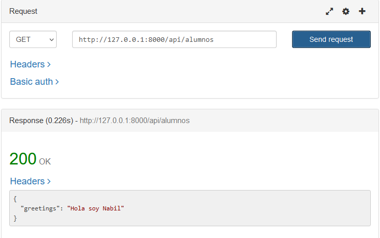

<div align="justify">


### Práctica 01

> 📂
> Crear el proyecto desde cero y seguir los pasos descritos: modificar
apropiadamente las relaciones manytomany con los belongsto (Lo ideal sería crear las
migraciones, de estas con krlove obtener las clases del modelo y hacer las modificaciones en la manytomany)
>

```php

```

- Captura:
<div align="center">

</div>

***
</br>

### Práctica 02

> 📂
> Crear un controller: AlumnoRESTController siguiendo el patrón antes
definido. Poner en: index() que devuelva: “saludo”=>”Hola soy (nombrealumno) “
Acceder mediante Rested ( o equivalente ) a la ruta: api/alumnos Comprobar que
devuelve el mensaje
>


```php
class AlumnoRESTController extends Controller
{
    /**
     * Display a listing of the resource.
     */
    public function index(){
        $greetings = 'Hola soy Nabil';

        return response()->json([
            'greetings' => $greetings
        ]);
    }
}
```

- Captura:
<div align="center">

</div>

</br>

</div>