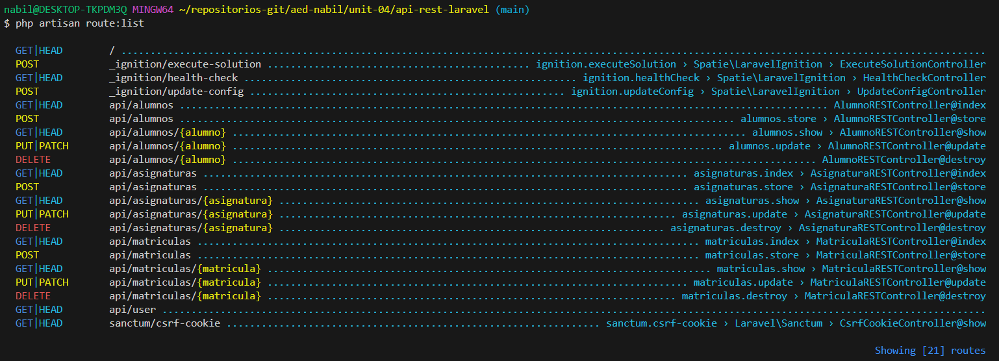

<div align="justify">


### Práctica 01

> 📂
> Crear el proyecto desde cero y seguir los pasos descritos: modificar
apropiadamente las relaciones manytomany con los belongsto (Lo ideal sería crear las
migraciones, de estas con krlove obtener las clases del modelo y hacer las modificaciones en la manytomany)
>

```php

```

- Captura:
<div align="center">

</div>

***
</br>

### Práctica 02

> 📂
> Crear un controller: AlumnoRESTController siguiendo el patrón antes
definido. Poner en: index() que devuelva: “saludo”=>”Hola soy (nombrealumno) “
Acceder mediante Rested ( o equivalente ) a la ruta: api/alumnos Comprobar que
devuelve el mensaje
>


```php
class AlumnoRESTController extends Controller
{
    /**
     * Display a listing of the resource.
     */
    public function index(){
        $greetings = 'Hola soy Nabil';

        return response()->json([
            'greetings' => $greetings
        ]);
    }
}
```

- Captura:
<div align="center">

</div>

</br>


### Práctica 03

> 📂
> Crear para la api todos los puntos en api.php de rutas de resource para nuestros
objetos: Alumno, Matricula, Asignatura. Busca información de como excluir el borrado de
ApiResource(“alumnos”) y ponlo luego como una linea adicional ( la forma que hemos
hecho siempre, mediante: Route::delete… ) Después toma captura de pantalla de la salida
de php artisan route:list
>

- api.php
```php

Route::apiResource('alumnos', AlumnoRESTController::class)->except(['destroy']);

Route::prefix('')->group(function (){
    Route::get('alumnos', [AlumnoRESTController::class, 'index']);
    Route::delete('alumnos/{alumno}', [AlumnoRESTController::class, 'destroy']);
});

Route::apiResource('asignaturas', AsignaturaRESTController::class);

Route::prefix('asignaturas')->group(function (){
    Route::get('/', [AsignaturaRESTController::class, 'index']);
});


Route::apiResource('matriculas', MatriculaRESTController::class);
Route::prefix('matriculas')->group(function (){
    Route::get('/', [MatriculaRESTController::class, 'index']);
});
```

- AlumnoRESTController:

```php	
/**
 * Remove the specified resource from storage.
 */
public function destroy(Alumno $alumno)
{
    $alumno->delete();
    $message = 'Student successfully deleted';

    return response()->json([
        'message' => $message
    ]);
}
```

- Captura:
<div align="center">

</div>

</br>

</div>